<!-- @import "[TOC]" {cmd="toc" depthFrom=1 depthTo=6 orderedList=false} -->

<!-- code_chunk_output -->

- [第一章、JVM与java体系结构](#第一章jvm与java体系结构)
  - [前置：java的执行流程](#前置java的执行流程)
  - [一、JVM的位置](#一jvm的位置)
  - [二、JVM的整体结构](#二jvm的整体结构)
  - [三、JVM的架构模型](#三jvm的架构模型)
  - [四、JVM的生命周期](#四jvm的生命周期)
  - [五、JVM的发展历程](#五jvm的发展历程)
- [第二章、类加载子系统](#第二章类加载子系统)
  - [1.类加载器](#1类加载器)
    - [(1)Loading](#1loading)
    - [(2)Linking](#2linking)
    - [(3)Initialization](#3initialization)
  - [2.类加载器的分类](#2类加载器的分类)
    - [(1)引导类加载器(启动类加载器)](#1引导类加载器启动类加载器)
    - [(2)拓展类加载器](#2拓展类加载器)
    - [(3)系统类加载器(应用程序加载器)](#3系统类加载器应用程序加载器)
    - [(4)自定义类加载器](#4自定义类加载器)
    - [(5)关于ClassLoader](#5关于classloader)
  - [3.双亲委派机制](#3双亲委派机制)
    - [(1)工作原理](#1工作原理)
      - [举例](#举例)
    - [(2)优势](#2优势)
    - [(3)沙箱安全机制](#3沙箱安全机制)
  - [4.其他](#4其他)
- [三、运行时数据区](#三运行时数据区)
  - [1.概述](#1概述)
  - [2.线程](#2线程)
  - [3.运行时数据区的组成部分](#3运行时数据区的组成部分)
    - [(1)程序计数器(PC寄存器):既没有GC，也没有OOM(溢出)](#1程序计数器pc寄存器既没有gc也没有oom溢出)
    - [(2)虚拟机栈:没有GC，存在OOM(溢出)](#2虚拟机栈没有gc存在oom溢出)
      - [概述](#概述)
        - [基本内容](#基本内容)
      - [栈的存储单位](#栈的存储单位)
        - [栈桢](#栈桢)
          - [局部变量表](#局部变量表)
          - [操作数栈](#操作数栈)
          - [动态链接](#动态链接)
          - [方法返回地址](#方法返回地址)
          - [一些附加信息](#一些附加信息)
      - [栈的相关面试题](#栈的相关面试题)
    - [(3)本地方法栈](#3本地方法栈)
      - [概述](#概述-1)
    - [(4)堆](#4堆)
      - [概述](#概述-2)
      - [设置堆内存大小与OOM](#设置堆内存大小与oom)
      - [年轻代与老年代](#年轻代与老年代)
      - [图解对象的分配过程](#图解对象的分配过程)
      - [Minor GC、Major GC、Full GC](#minor-gcmajor-gcfull-gc)
      - [堆空间分代思想](#堆空间分代思想)
      - [内存分配策略](#内存分配策略)
      - [为对象分配内存：TLAB](#为对象分配内存tlab)
      - [小结堆空间的参数设置](#小结堆空间的参数设置)
      - [堆是分配对象的唯一选择吗(逃逸分析)](#堆是分配对象的唯一选择吗逃逸分析)
      - [本章小节](#本章小节)
    - [(5)方法区](#5方法区)
      - [栈、堆、方法区的交互关系](#栈堆方法区的交互关系)
      - [方法区的理解](#方法区的理解)
      - [设置方法区大小与OOM](#设置方法区大小与oom)
      - [方法区的内部结构](#方法区的内部结构)
      - [方法区使用举例](#方法区使用举例)
      - [方法区的演进细节](#方法区的演进细节)
      - [方法区的垃圾回收](#方法区的垃圾回收)
  - [4.总结](#4总结)
  - [5.面试题](#5面试题)
- [四、本地方法库和本地方法接口](#四本地方法库和本地方法接口)
  - [概述](#概述-3)
    - [什么是本地方法](#什么是本地方法)
    - [为什么要使用Native Method](#为什么要使用native-method)
    - [现状](#现状)
- [五、执行引擎](#五执行引擎)
  - [概述](#概述-4)
  - [Java代码编译和执行过程](#java代码编译和执行过程)
  - [机器码、指令、汇编语言](#机器码指令汇编语言)
  - [解释器](#解释器)
  - [JIT编译器](#jit编译器)
  - [关于解释器和JIT编译器的设置](#关于解释器和jit编译器的设置)
  - [垃圾回收(GC)](#垃圾回收gc)
    - [垃圾回收的概述](#垃圾回收的概述)
      - [什么是垃圾](#什么是垃圾)
      - [为什么需要GC](#为什么需要gc)
      - [早期垃圾回收](#早期垃圾回收)
      - [Java垃圾回收机制](#java垃圾回收机制)
      - [面试题](#面试题)
    - [垃圾回收相关算法](#垃圾回收相关算法)
      - [标记阶段](#标记阶段)
        - [标记阶段:引用计数算法](#标记阶段引用计数算法)
        - [标记阶段:可达性分析算法](#标记阶段可达性分析算法)
      - [对象的finalization机制](#对象的finalization机制)
      - [MAT和JProfiler的GC Roots溯源](#mat和jprofiler的gc-roots溯源)
        - [MAT](#mat)
        - [JProfiler](#jprofiler)
      - [清除阶段](#清除阶段)
        - [清除阶段:标记-清除算法](#清除阶段标记-清除算法)
        - [清除阶段:复制算法](#清除阶段复制算法)
        - [清除阶段:标记-压缩算法](#清除阶段标记-压缩算法)
      - [小结](#小结)
      - [分代收集算法](#分代收集算法)
      - [增量收集算法、分区算法](#增量收集算法分区算法)
        - [增量收集算法](#增量收集算法)
        - [分区算法](#分区算法)
    - [垃圾回收相关概念](#垃圾回收相关概念)
      - [System.gc()的理解](#systemgc的理解)
      - [内存溢出和内存泄漏](#内存溢出和内存泄漏)
        - [内存溢出](#内存溢出)
        - [内存泄漏](#内存泄漏)
      - [Stop The World](#stop-the-world)
      - [垃圾回收的并行与并发](#垃圾回收的并行与并发)
        - [引入：程序的并行与并发](#引入程序的并行与并发)
        - [垃圾回收的并行与并发](#垃圾回收的并行与并发-1)
      - [安全点与安全区域](#安全点与安全区域)
        - [安全点](#安全点)
        - [安全区域](#安全区域)
      - [再谈引用:强引用](#再谈引用强引用)
      - [再谈引用:软引用](#再谈引用软引用)
      - [再谈引用:弱引用](#再谈引用弱引用)
      - [再谈引用:虚引用](#再谈引用虚引用)
      - [再谈引用:终结器引用](#再谈引用终结器引用)
    - [垃圾回收器](#垃圾回收器)
      - [GC分类与性能指标](#gc分类与性能指标)
        - [GC的分类](#gc的分类)
        - [GC的性能指标](#gc的性能指标)
      - [不同的垃圾回收器概述](#不同的垃圾回收器概述)
      - [Serial回收器:串行回收](#serial回收器串行回收)
      - [ParNew回收器:并行回收](#parnew回收器并行回收)
      - [Parallel回收器:吞吐量优先](#parallel回收器吞吐量优先)
      - [CMS回收器:低延迟](#cms回收器低延迟)
      - [G1回收器:区域化分代式](#g1回收器区域化分代式)
      - [垃圾回收器总结](#垃圾回收器总结)
      - [GC日志分析](#gc日志分析)
      - [垃圾回收器的新发展](#垃圾回收器的新发展)
- [插入内容1、对象的实例化内存布局与访问定位](#插入内容1对象的实例化内存布局与访问定位)
  - [对象的实例化](#对象的实例化)
    - [六个步骤](#六个步骤)
  - [对象的内存布局](#对象的内存布局)
    - [面试题](#面试题-1)
  - [对象的访问定位](#对象的访问定位)
    - [对象主要的访问方式](#对象主要的访问方式)
      - [句柄访问](#句柄访问)
      - [直接指针(HotSpot采用)](#直接指针hotspot采用)
- [插入内容2、直接内存](#插入内容2直接内存)
- [插入内容3、StringTable](#插入内容3stringtable)
  - [String的基本特性](#string的基本特性)
  - [String的内存分配](#string的内存分配)
  - [String的基本特性](#string的基本特性-1)
  - [字符串拼接操作](#字符串拼接操作)
  - [intern()的使用](#intern的使用)
  - [StringTable的垃圾回收](#stringtable的垃圾回收)
  - [G1中的String去重操作](#g1中的string去重操作)
    - 

<!-- /code_chunk_output -->

# 第一章、JVM与java体系结构
## 前置：java的执行流程

## 一、JVM的位置
> 
> 
## 二、JVM的整体结构
> 
## 三、JVM的架构模型
> 
> 
## 四、JVM的生命周期
> 
> 
## 五、JVM的发展历程
> 
> 
> 
>>- #### HotSpot虚拟机
>>> 
>>>
> 
> 
> 
> 
> 
> 
> 
> 
> 
> 
---
# 第二章、类加载子系统
> 
> 
> 
## 1.类加载器
>> 
>> 
>> 
>> 
### (1)Loading
>>> 
>>> 
### (2)Linking
>>> 
### (3)Initialization
>>> 
>>> 
## 2.类加载器的分类
>> 
>> 
>> 
>> 
### (1)引导类加载器(启动类加载器)
>> 
### (2)拓展类加载器
>> 
### (3)系统类加载器(应用程序加载器)
>> 
### (4)自定义类加载器
>> 
>> 
### (5)关于ClassLoader
>> 
>> 
## 3.双亲委派机制
>> 
### (1)工作原理
>>> 
#### 举例
>>>> 
### (2)优势
>>> 
### (3)沙箱安全机制
>>> 
## 4.其他
>>> 
>>> 
>>> 
---
# 三、运行时数据区
## 1.概述
>> 
>> 
>> 
>> 
>> 
## 2.线程
>> 
>> 
## 3.运行时数据区的组成部分
### (1)程序计数器(PC寄存器):既没有GC，也没有OOM(溢出)
>>> 
>>> 
>>> 
>>> 
>>> 
>>> 
>>> 
>>> 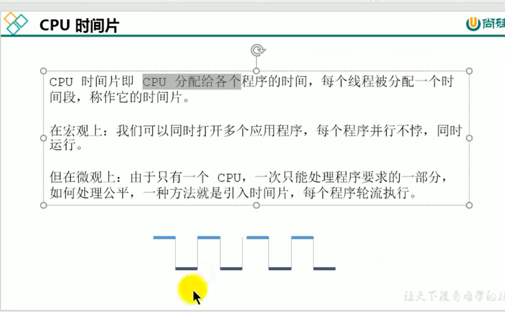
### (2)虚拟机栈:没有GC，存在OOM(溢出)
#### 概述
>>>> 
>>>> 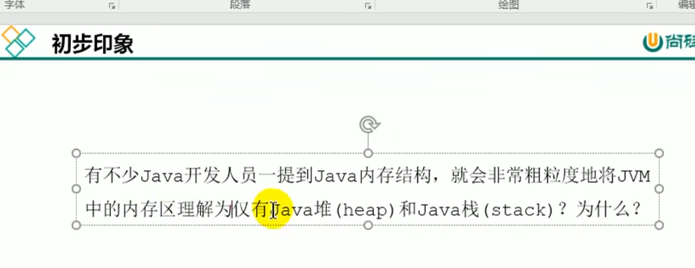
>>>> 
>>>> 
##### 基本内容
>>>>> 
>>>>> 
>>>>> 
#### 栈的存储单位
>>>> 
>>>> 
>>>> 
##### 栈桢
>>>>> 
###### 局部变量表
>>>>>> 
>>>>>> 
>>>>>> 
>>>>>> 
>>>>>> 
>>>>>> 
>>>>>> 
###### 操作数栈
>>>>>> 
>>>>>> 
>>>>>> 
>>>>>> 
>>>>>> 
>>>>>> 
>>>>>> 
>>>>>> 栈顶缓存技术
>>>>>>> 
###### 动态链接
>>>>>> 
>>>>>> 
>>>>>> 方法的调用
>>>>>>> 
>>>>>>> 
>>>>>>> 
>>>>>>> 
>>>>>>> 
>>>>>>> 
>>>>>>> 
>>>>>>> 
>>>>>>> 
>>>>>>> 
###### 方法返回地址
>>>>>> 
>>>>>> 
>>>>>> 
>>>>>> 
###### 一些附加信息
>>>>>> 
#### 栈的相关面试题
>>>> 
>>>> 
### (3)本地方法栈
#### 概述
>>>> 
>>>> 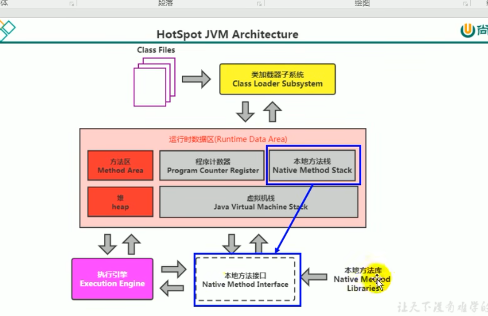
>>>> 
### (4)堆
#### 概述
>>>> 
>>>> 
>>>> 
>>>> 
>>>> 
>>>> 
#### 设置堆内存大小与OOM
>>>> 
>>>> 
>>>> 
#### 年轻代与老年代
>>>> 
>>>> 
>>>> 
>>>> 
>>>> 
#### 图解对象的分配过程
>>>> 
>>>> 
>>>> 
>>>> 
>>>> 
>>>> 
>>>> 
#### Minor GC、Major GC、Full GC
>>>> 
>>>> 
>>>> 
>>>> 
>>>> 
#### 堆空间分代思想
>>>> 
>>>> 
#### 内存分配策略
>>>> 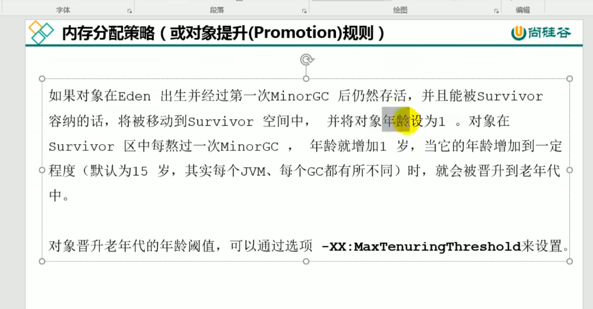
>>>> 
#### 为对象分配内存：TLAB
>>>> 
>>>> 
>>>> 
>>>> 
>>>> 
#### 小结堆空间的参数设置
>>>> 
>>>> 
>>>> 
#### 堆是分配对象的唯一选择吗(逃逸分析)
>>>> 
>>>> 
>>>> 
>>>> 
>>>> 
>>>> 
>>>> 
>>>> 
>>>> 
>>>> 
>>>> 
>>>> 
#### 本章小节
>>>> 
### (5)方法区
>>> 
#### 栈、堆、方法区的交互关系
>>>> 
#### 方法区的理解
>>>> 
>>>> 
>>>> 
>>>> 
>>>> 
>>>> 
#### 设置方法区大小与OOM
>>>> 
>>>> 
>>>> 
#### 方法区的内部结构
>>>> 
>>>> 
>>>> 
>>>> 
>>>> 
>>>> 
>>>> 
>>>> 
>>>> 
>>>> 
>>>> 
>>>> 
>>>> 
#### 方法区使用举例
#### 方法区的演进细节
>>>> 
>>>> 
>>>> 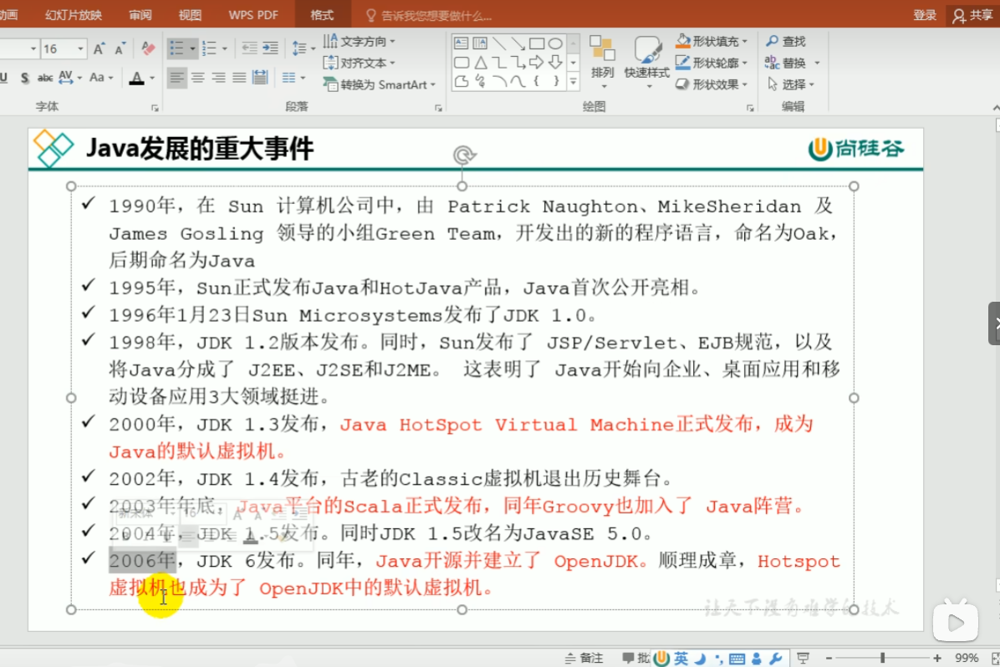
>>>> 
>>>> 
>>>> 
>>>> 
#### 方法区的垃圾回收
>>>> 
>>>> 
>>>> 
## 4.总结
>> 
## 5.面试题
>> 
>> 
---
# 四、本地方法库和本地方法接口
> 
## 概述
### 什么是本地方法
>>> 
>>> 
### 为什么要使用Native Method
>>> 
>>> 
### 现状
>>> 
---
# 五、执行引擎
## 概述
>> 
>> 
>> 
## Java代码编译和执行过程
>> 
>> 
>> 
>> 
>> 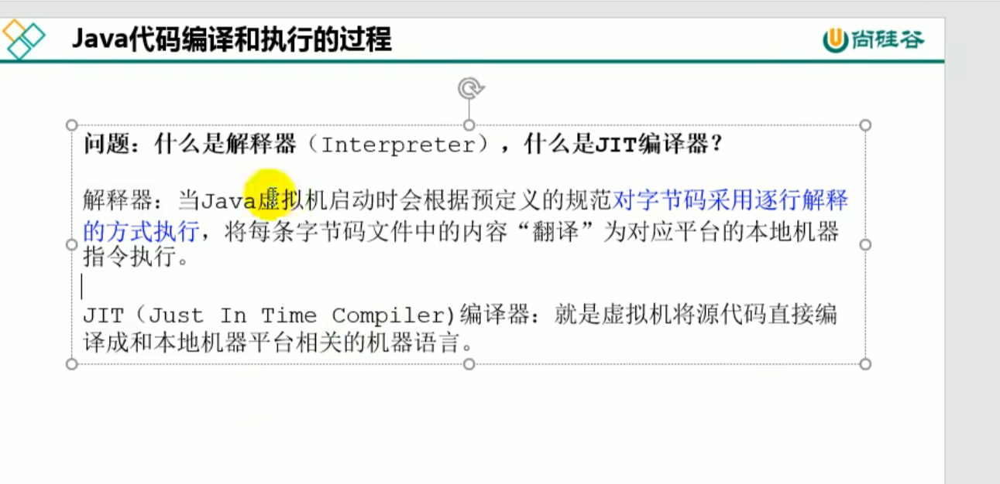
>> 
>> 
## 机器码、指令、汇编语言
>> 
>> 
>> 
>> 
>> 
## 解释器
>> 
>> 
>> 
>> 
## JIT编译器
>> 
>> 
>> 
>> 
>> 
>> 
>> 
>> 
>> 
>> 
>> 
>> 
>> 
>> 
>> 
>> 
>> 
>> 
## 关于解释器和JIT编译器的设置
>> 
## 垃圾回收(GC)
### 垃圾回收的概述
#### 什么是垃圾
>>>> 
>>>> 
>>>> 
#### 为什么需要GC
>>>> 
#### 早期垃圾回收
>>>> 
>>>> 
#### Java垃圾回收机制
>>>> 
>>>> 
>>>> 
#### 面试题
>>>> 
### 垃圾回收相关算法
#### 标记阶段
>>>> 
##### 标记阶段:引用计数算法
>>>>> 
>>>>> 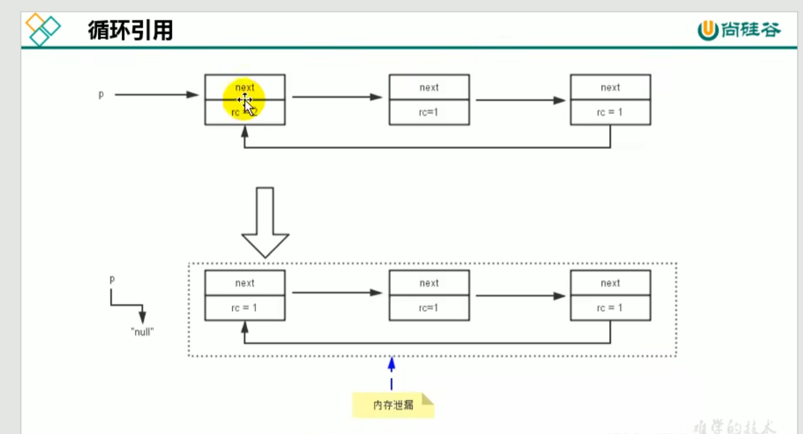
>>>>> 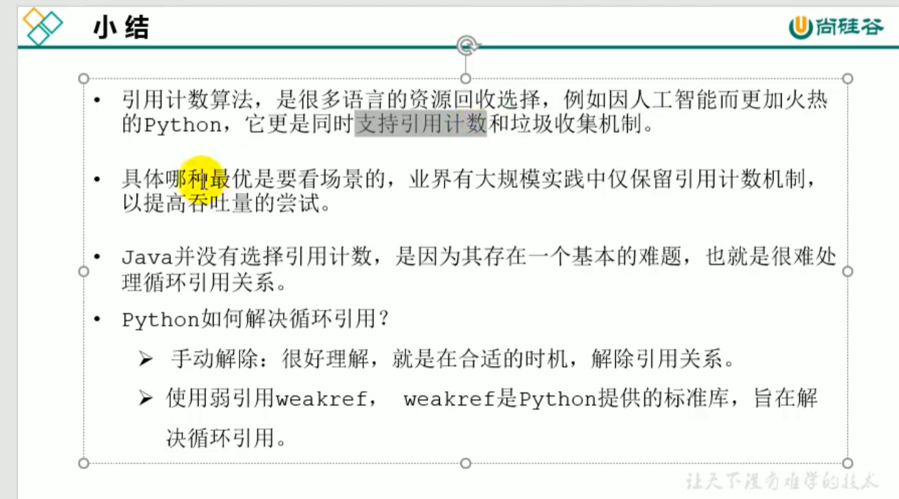
##### 标记阶段:可达性分析算法
>>>>> 
>>>>> 
>>>>> 
>>>>> 
>>>>> 
>>>>> 
>>>>> 
#### 对象的finalization机制
>>>> 
>>>> 
>>>> 
>>>> 
#### MAT和JProfiler的GC Roots溯源
>>>> 
>>>> 
##### MAT
>>>>> 
##### JProfiler
#### 清除阶段
>>>> 
##### 清除阶段:标记-清除算法
>>>>> 
>>>>> 
>>>>> 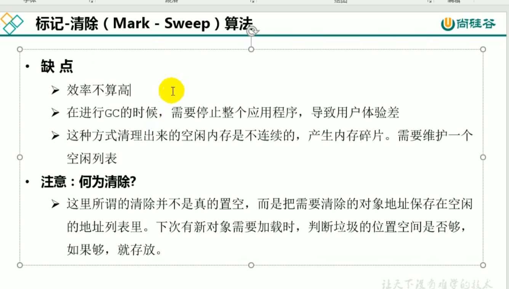
##### 清除阶段:复制算法
>>>>> 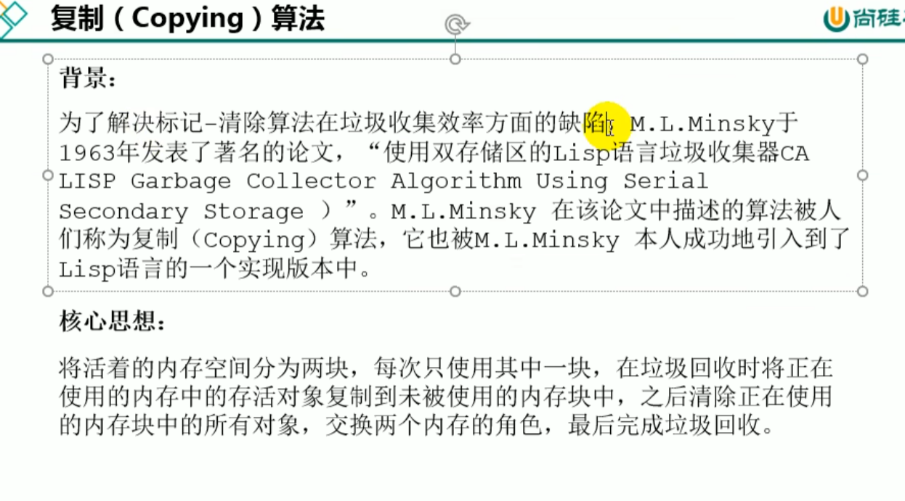
>>>>> 
>>>>> 
##### 清除阶段:标记-压缩算法
>>>>> 
>>>>> 
>>>>> 
>>>>> 
#### 小结
>>>> 
#### 分代收集算法
>>>> 
>>>> 
>>>> 
#### 增量收集算法、分区算法
##### 增量收集算法
>>>>> 
>>>>> 
##### 分区算法
>>>>> 
>>>> 
### 垃圾回收相关概念
#### System.gc()的理解
>>>> 
>>>> 
#### 内存溢出和内存泄漏
##### 内存溢出
>>>>> 
>>>>> 
>>>>> 
##### 内存泄漏
>>>>> 
>>>>> 
>>>>> 
#### Stop The World
>>>> 
>>>> 
#### 垃圾回收的并行与并发
##### 引入：程序的并行与并发
>>>>> 
>>>>> 
>>>>> 
##### 垃圾回收的并行与并发
>>>>> 
>>>>> 
#### 安全点与安全区域
##### 安全点
>>>>> 
>>>>> 
##### 安全区域
>>>>> 
>>>>> 
#### 再谈引用:强引用
>>>> 
>>>> 
>>>> 
#### 再谈引用:软引用
>>>> 
>>>> 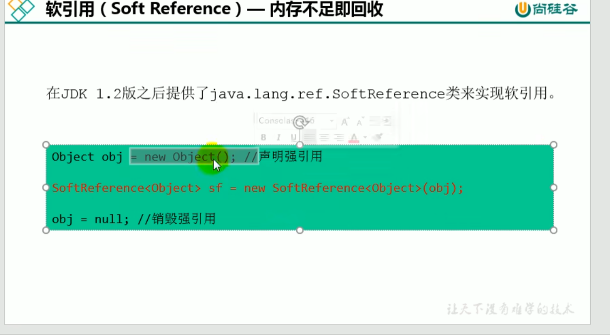
#### 再谈引用:弱引用
>>>> 
>>>> 
#### 再谈引用:虚引用
>>>> 
>>>> 
#### 再谈引用:终结器引用
>>>> 
### 垃圾回收器
#### GC分类与性能指标
##### GC的分类
>>>>> 
>>>>> 
>>>>> 
>>>>> 
>>>>> 
##### GC的性能指标
>>>>> 
>>>>> 
>>>>> 
>>>>> 
>>>>> 
>>>>> 
#### 不同的垃圾回收器概述
>>>> 
>>>> 
>>>> 
>>>> 
>>>> 
>>>> 
>>>> 
>>>> 
>>>> 
#### Serial回收器:串行回收
>>>> 
>>>> 
>>>> 
>>>> 
#### ParNew回收器:并行回收
>>>> 
>>>> 
>>>> 
>>>> 
#### Parallel回收器:吞吐量优先
>>>> 
>>>> 
>>>> 
>>>> 
>>>> 
>>>> 
>>>> 
#### CMS回收器:低延迟
>>>> 
>>>> 
>>>> 
>>>> 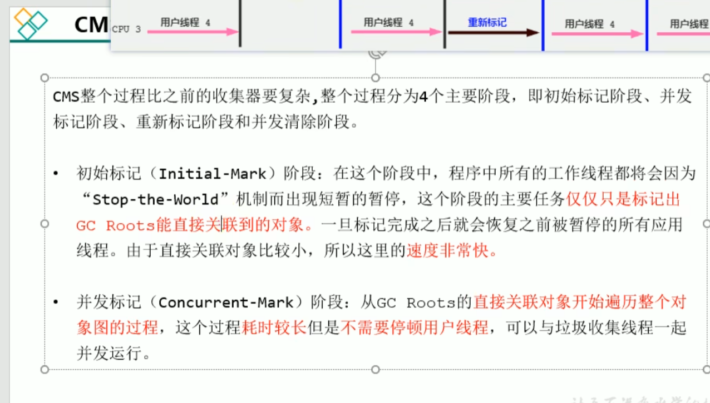
>>>> 
>>>> 
>>>> 
>>>> 
>>>> 
>>>> 
>>>> 
>>>> 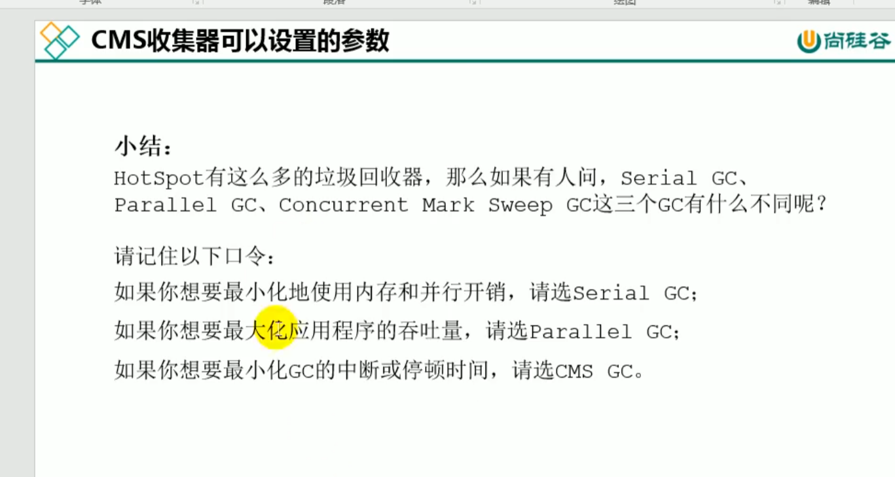
>>>> 
#### G1回收器:区域化分代式
>>>> 
>>>> 
>>>> 
>>>> 
>>>> 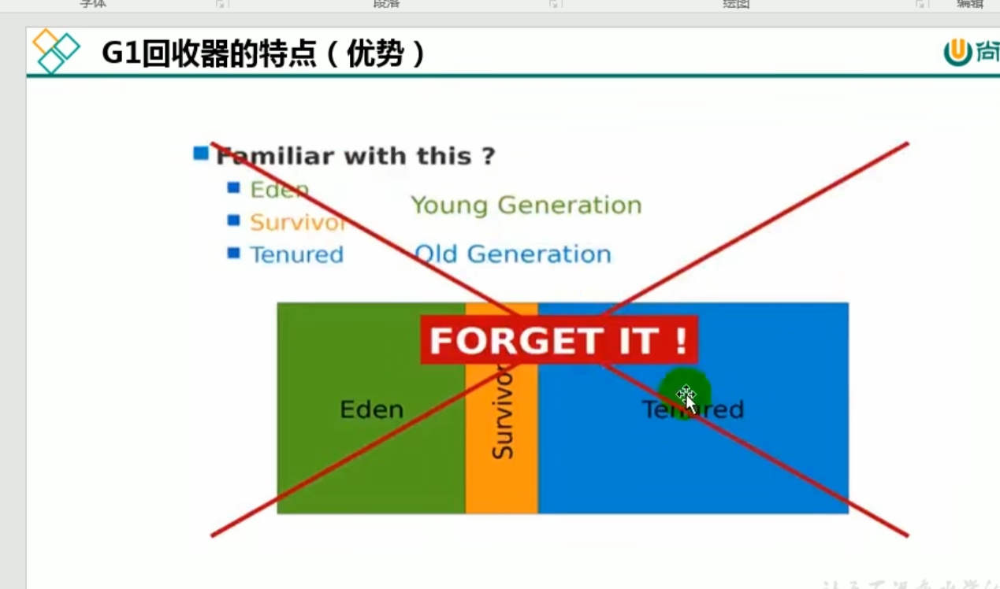
>>>> 
>>>> 
>>>> 
>>>> 
>>>> 
>>>> 
>>>> 
>>>> 
>>>> 
>>>> 
>>>> 
>>>> 
>>>> 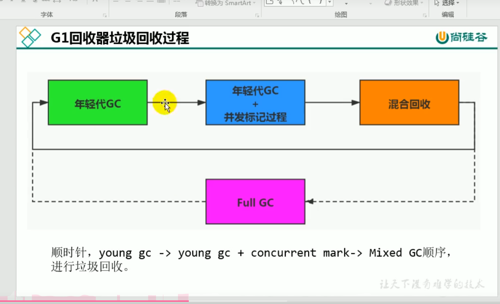
>>>> 
>>>> 
>>>> 
>>>> 
>>>> 
>>>> 
>>>> 
>>>> 
>>>> 
>>>> 
>>>> 
>>>> 
#### 垃圾回收器总结
>>>> 
>>>> 
>>>> 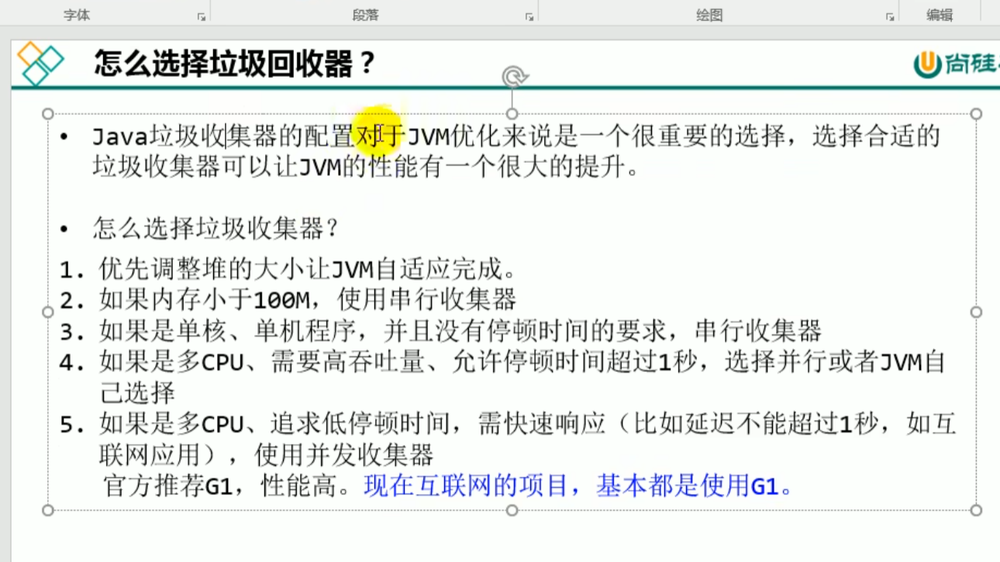
>>>> 
>>>> 
#### GC日志分析
>>>> 
>>>> 
>>>> 
>>>> 
>>>> 
>>>> 
>>>> 
>>>> 
>>>> 
>>>> 
>>>> 
>>>> 
#### 垃圾回收器的新发展
>>>> 
>>>> 
>>>> 
>>>> 
>>>> 
>>>> 
>>>> 
>>>> 
>>>> 
>>>> 
>>>> 
>>>> 
>>>> 
>>>> 
---
# 插入内容1、对象的实例化内存布局与访问定位
## 对象的实例化
>> 
>> 
>> 
>> 
### 六个步骤
>>> 
>>> 
>>> 
>>> 
>>> 
>>> 
>>> 
>>> 
## 对象的内存布局
>> 
>> 
### 面试题
>>> 
## 对象的访问定位
>> 
>> 
### 对象主要的访问方式
#### 句柄访问
>>>> 
>>>> 
#### 直接指针(HotSpot采用)
>>>> 
# 插入内容2、直接内存
> 
> 
> 
> 
> 
# 插入内容3、StringTable
## String的基本特性
>> 
>> 
>> 
>> 
>> 
## String的内存分配
>> 
>> 
>> 
## String的基本特性
>> 
## 字符串拼接操作
>> 
>> 
>> 
>> 
>> 
>> 
>> 
>> 
>> 
>> 
>> 
## intern()的使用
>> 
>> 
>> 
## StringTable的垃圾回收
---
---
## G1中的String去重操作
>> 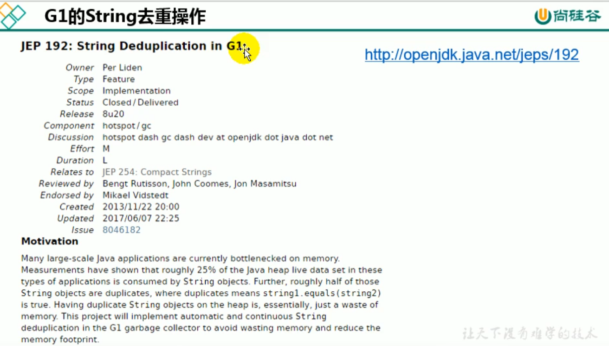
>> 
>> 
>> 
---
---
###