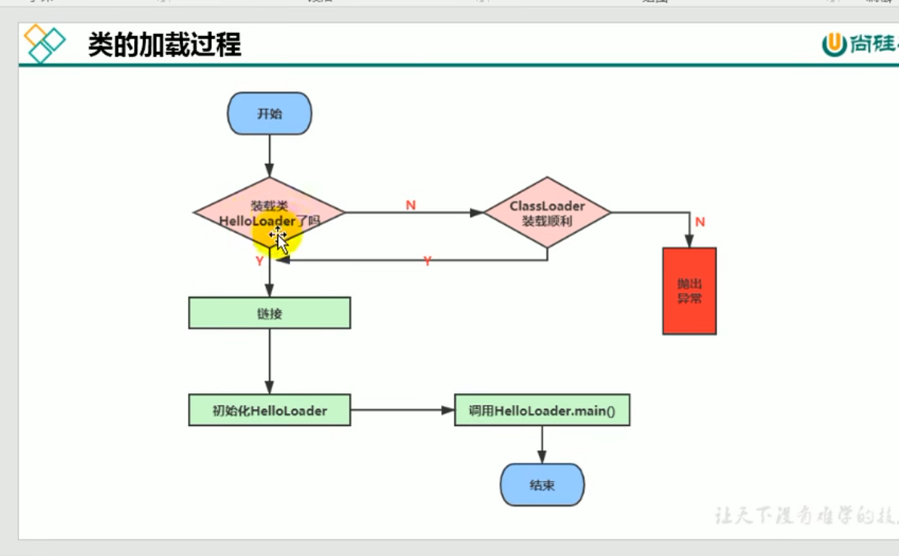
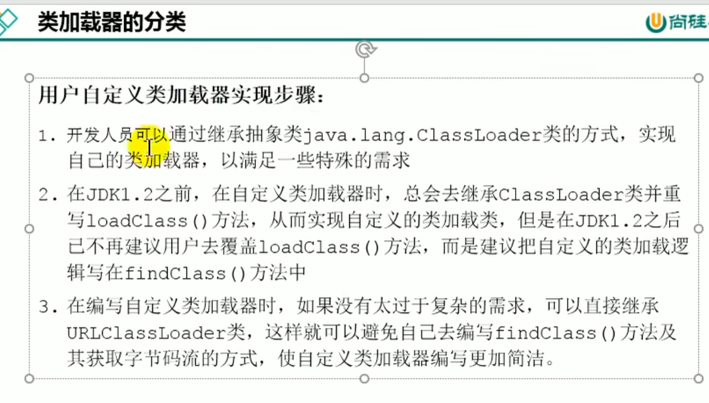

[toc]
# 第一章、JVM与java体系结构
## 前置：java的执行流程

## 一、JVM的位置
> 
> 
## 二、JVM的整体结构
> 
## 三、JVM的架构模型
> 
> 
## 四、JVM的生命周期
> 
> 
## 五、JVM的发展历程
> 
> 
> 
>>- #### HotSpot虚拟机
>>> 
>>>
> 
> 
> 
> 
> 
> 
> 
> 
> 
> 
---
# 第二章、类加载子系统
> 
> 
> 
## 1.类加载器
>> 
>> 
>> 
>> 
### (1)Loading
>>> 
>>> 
### (2)Linking
>>> 
### (3)Initialization
>>> 
>>> 
## 2.类加载器的分类
>> 
>> 
>> 
>> 
### (1)引导类加载器(启动类加载器)
>> 
### (2)拓展类加载器
>> 
### (3)系统类加载器(应用程序加载器)
>> 
### (4)自定义类加载器
>> 
>> 
### (5)关于ClassLoader
>> 
>> 
## 3.双亲委派机制
>> 
### (1)工作原理
>>> 
#### 举例
>>>> 
### (2)优势
>>> 
### (3)沙箱安全机制
>>> 
## 4.其他
>>> 
>>> 
>>> 
---
# 三、运行时数据区
## 1.概述
>> 
>> 
>> 
>> 
>> 
## 2.线程
>> 
>> 
## 3.运行时数据区的组成部分
### (1)程序计数器(PC寄存器):既没有GC，也没有OOM(溢出)
>>> 
>>> 
>>> 
>>> 
>>> 
>>> 
>>> 
>>> 
### (2)虚拟机栈:没有GC，存在OOM(溢出)
#### 概述
>>>> 
>>>> 
>>>> 
>>>> 
##### 基本内容
>>>>> 
>>>>> 
>>>>> 
#### 栈的存储单位
>>>> 
>>>> 
>>>> 
##### 栈桢
>>>>> 
###### 局部变量表
>>>>>> 
>>>>>> 
>>>>>> 
>>>>>> 
>>>>>> 
>>>>>> 
>>>>>> 
###### 操作数栈
>>>>>> 
>>>>>> 
>>>>>> 
>>>>>> 
>>>>>> 
>>>>>> 
>>>>>> 
>>>>>> 栈顶缓存技术
>>>>>>> 
###### 动态链接
>>>>>> 
>>>>>> 
>>>>>> 方法的调用
>>>>>>> 
>>>>>>> 
>>>>>>> 
>>>>>>> 
>>>>>>> 
>>>>>>> 
>>>>>>> 
>>>>>>> 
>>>>>>> 
>>>>>>> 
###### 方法返回地址
>>>>>> 
>>>>>> 
>>>>>> 
>>>>>> 
###### 一些附加信息
>>>>>> 
#### 栈的相关面试题
>>>> 
>>>> 
### (3)本地方法栈
#### 概述
>>>> 
>>>> 
>>>> 
### (4)堆
#### 概述
>>>> 
>>>> 
#### 设置堆内存大小与OOM
#### 年轻代与老年代
#### 图解对象的分配过程
#### Minor GC、Major GC、Full GC
#### 堆空间分配思想
#### 内存分配策略
#### 为对象分配内存：TLAB
#### 小结堆空间的参数设置
#### 堆是分配对象的唯一选择吗
---
# 四、本地方法库和本地方法接口
> 
## 概述
### 什么是本地方法
>>> 
>>> 
### 为什么要使用Native Method
>>> 
>>> 
### 现状
>>> 
