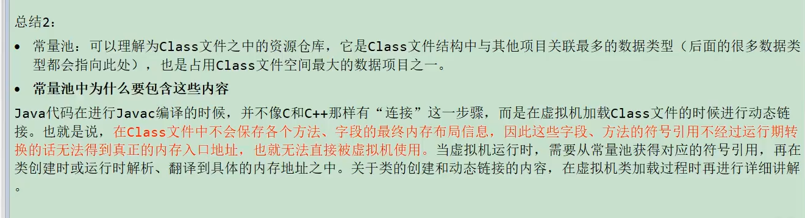

[toc]
# 一、Class文件结构
## 概述
### 字节码文件的跨平台性
>>> 
### java的前端编译器
>>> 
>>> 
>>> 
>>> 
>>> 
>>> 
>>> 
### 透过字节码指令看代码细节
>>> 
## 虚拟机的基石：Class文件
>>> 
>>> 
>>> 
>>> 
## Class文件结构
>> 
>> 
>> 
>> 
>> 
>> 
### 魔数：Class文件的标志
>>> 
### 魔数：Class文件版本号
>>> 
>>> 
### 常量池：存放所有常量
>>> 
>>> 
>>> 
#### 常量池计数器
>>>> 
#### 常量池表
>>>> 
>>>> 
##### 字面量和符号引用
>>>>> 
>>>>> 
>>>>> 
>>>>> 
##### 常量类型和结构
>>>>> 
>>>>> 
>>>>> 
>>>>> 
>>>>> 
### 访问标识
>>> 
>>> 
>>> 
### 类索引、父类索引、接口索引集合
>>> 
>>> 
### 字段表集合
>>> 
#### 字段计数器
>>> 
#### 字段表
>>> 
>>> 
>>> 
>>> 
>>> 
>>> 
### 方法表集合
#### 方法计数器
#### 方法表
### 属性表集合
#### 属性计数器
#### 属性表
### 小结
## 使用javap指令解析Class文件
### javap的用法
### 使用举例
### 总结
# 二、字节码指令集与解析举例
# 三、类的加载过程详解
# 四、再谈类的加载器