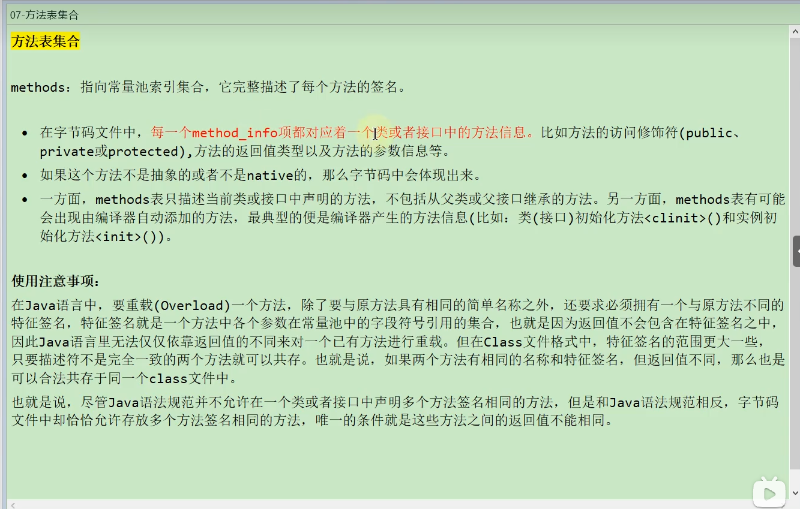
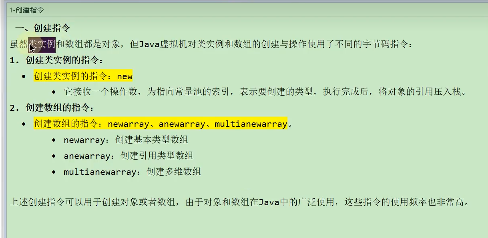
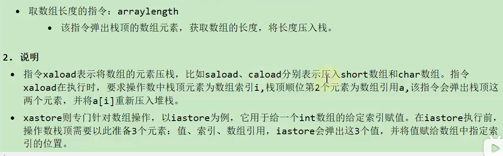
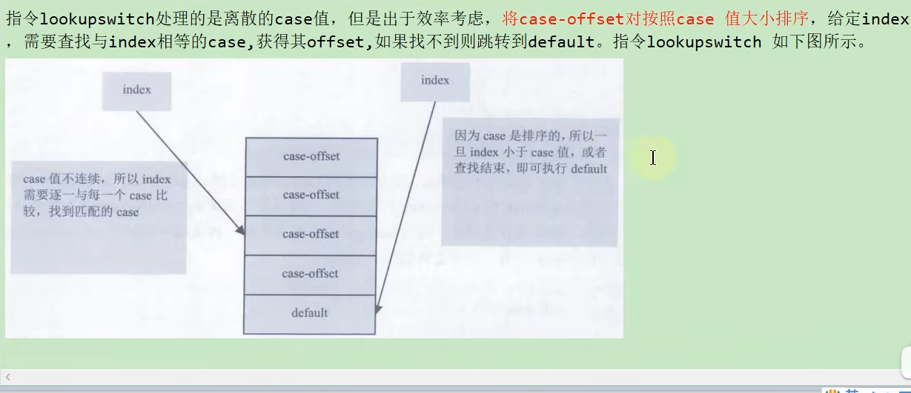
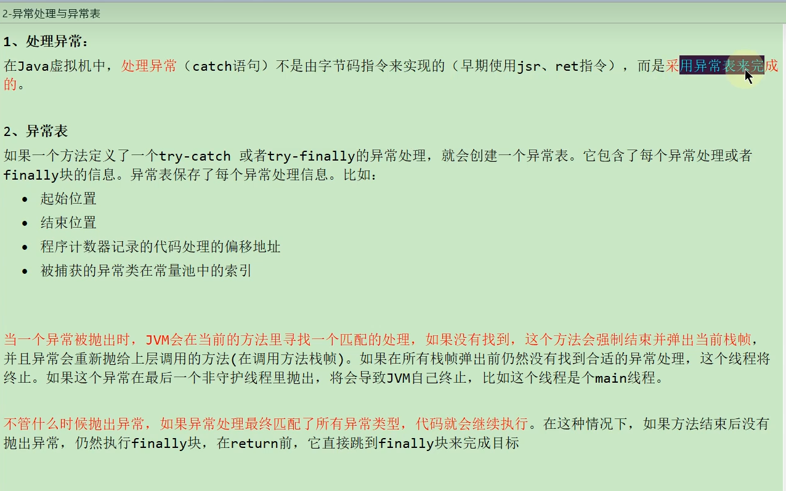
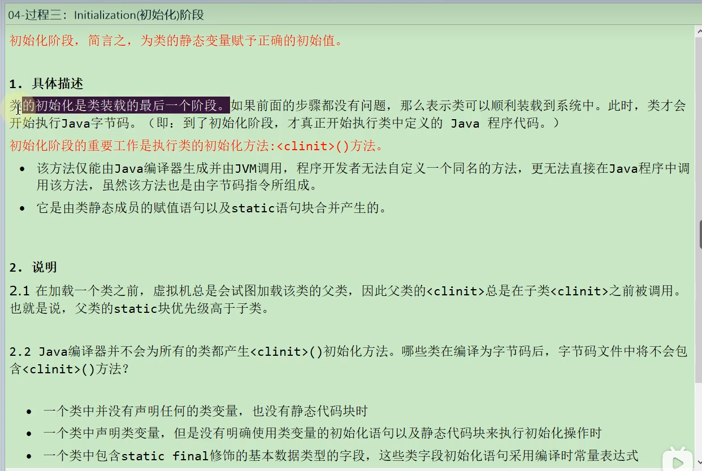
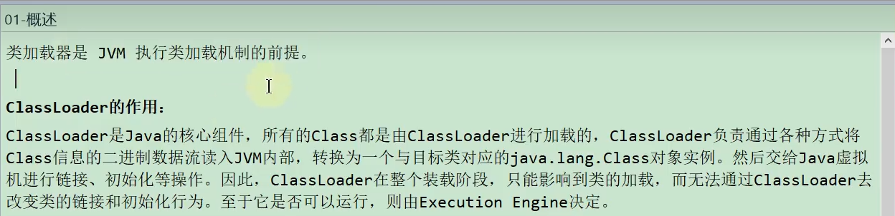
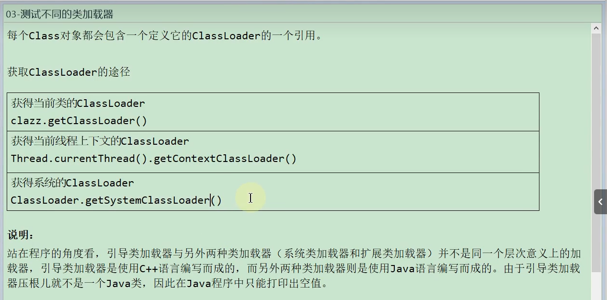

<!-- @import "[TOC]" {cmd="toc" depthFrom=1 depthTo=6 orderedList=false} -->

<!-- code_chunk_output -->

- [一、Class文件结构](#一class文件结构)
  - [概述](#概述)
    - [字节码文件的跨平台性](#字节码文件的跨平台性)
    - [java的前端编译器](#java的前端编译器)
    - [透过字节码指令看代码细节](#透过字节码指令看代码细节)
  - [虚拟机的基石：Class文件](#虚拟机的基石class文件)
  - [Class文件结构](#class文件结构)
    - [魔数：Class文件的标志](#魔数class文件的标志)
    - [魔数：Class文件版本号](#魔数class文件版本号)
    - [常量池：存放所有常量](#常量池存放所有常量)
      - [常量池计数器](#常量池计数器)
      - [常量池表](#常量池表)
        - [字面量和符号引用](#字面量和符号引用)
        - [常量类型和结构](#常量类型和结构)
    - [访问标识](#访问标识)
    - [类索引、父类索引、接口索引集合](#类索引父类索引接口索引集合)
    - [字段表集合](#字段表集合)
      - [字段计数器](#字段计数器)
      - [字段表](#字段表)
    - [方法表集合](#方法表集合)
      - [方法计数器](#方法计数器)
      - [方法表](#方法表)
    - [属性表集合](#属性表集合)
      - [属性计数器](#属性计数器)
      - [属性表](#属性表)
        - [方法里的属性表](#方法里的属性表)
    - [小结](#小结)
  - [使用javap指令解析Class文件](#使用javap指令解析class文件)
    - [解析字节码的作用](#解析字节码的作用)
    - [javac -g操作](#javac--g操作)
    - [javap的用法](#javap的用法)
    - [使用举例](#使用举例)
    - [总结](#总结)
- [二、字节码指令集与解析举例](#二字节码指令集与解析举例)
  - [概述](#概述-1)
    - [执行模型](#执行模型)
    - [字节码与数据类型](#字节码与数据类型)
    - [指令分类](#指令分类)
      - [加载与存储指令](#加载与存储指令)
        - [复习：再谈操作数栈与局部变量表](#复习再谈操作数栈与局部变量表)
        - [局部变量压栈指令](#局部变量压栈指令)
        - [常量入栈指令](#常量入栈指令)
        - [出栈装入局部变量表指令](#出栈装入局部变量表指令)
      - [算数指令](#算数指令)
        - [所有算数指令](#所有算数指令)
        - [关于++运算符](#关于运算符)
        - [比较指令的说明](#比较指令的说明)
      - [类型转换指令](#类型转换指令)
        - [宽化类型转换](#宽化类型转换)
        - [窄化类型转换](#窄化类型转换)
      - [对象的创建与访问指令](#对象的创建与访问指令)
        - [创建指令](#创建指令)
        - [字段访问指令](#字段访问指令)
        - [数组操作指令](#数组操作指令)
        - [类型检查指令](#类型检查指令)
      - [方法调用与返回指令](#方法调用与返回指令)
        - [方法调用指令](#方法调用指令)
        - [返回指令](#返回指令)
      - [操作数栈管理指令](#操作数栈管理指令)
      - [控制转移指令](#控制转移指令)
        - [条件跳转指令](#条件跳转指令)
        - [比较条件跳转指令](#比较条件跳转指令)
        - [多条件分支跳转指令](#多条件分支跳转指令)
        - [无条件跳转指令](#无条件跳转指令)
      - [异常处理指令](#异常处理指令)
        - [抛出异常指令](#抛出异常指令)
        - [异常处理与异常表](#异常处理与异常表)
      - [同步控制指令](#同步控制指令)
        - [方法级的同步](#方法级的同步)
        - [方法内指定指令序列的同步](#方法内指定指令序列的同步)
- [三、类的加载过程详解](#三类的加载过程详解)
  - [概述](#概述-2)
  - [过程一：Loading(加载)阶段](#过程一loading加载阶段)
    - [加载完成的操作](#加载完成的操作)
    - [二进制流的获取方式](#二进制流的获取方式)
    - [类模型与Class实例的位置](#类模型与class实例的位置)
    - [数组类的加载](#数组类的加载)
  - [过程二：Linking(链接)阶段](#过程二linking链接阶段)
    - [Verification(验证)](#verification验证)
    - [Preparation(准备)](#preparation准备)
    - [Resolution(解析)](#resolution解析)
  - [过程三：Initialization(初始化)阶段](#过程三initialization初始化阶段)
    - [static与final的搭配问题](#static与final的搭配问题)
    - [\< clinit \>()的线程安全性](#-clinit-的线程安全性)
    - [类的初始化情况：主动使用vs被动使用](#类的初始化情况主动使用vs被动使用)
  - [过程四：类的Using(使用)](#过程四类的using使用)
  - [过程五：类的Unloading(卸载)](#过程五类的unloading卸载)
    - [回顾：方法区的垃圾回收](#回顾方法区的垃圾回收)
- [四、再谈类的加载器](#四再谈类的加载器)
  - [概述](#概述-3)
    - [大厂面试题](#大厂面试题)
    - [类加载的分类](#类加载的分类)
    - [类加载器的必要性](#类加载器的必要性)
    - [命名空间](#命名空间)
    - [类加载机制的基本特征](#类加载机制的基本特征)
  - [复习：类的加载器分类](#复习类的加载器分类)
    - [引导类加载器](#引导类加载器)
    - [拓展类加载器](#拓展类加载器)
    - [系统类加载器](#系统类加载器)
    - [用户自定义类加载器](#用户自定义类加载器)
  - [测试不同的类加载器](#测试不同的类加载器)
  - [ClassLoader源码分析](#classloader源码分析)
    - [ClassLoader的主要方法](#classloader的主要方法)
    - [SecureClassLoader与URLClassLoader](#secureclassloader与urlclassloader)
    - [ExtClassLoader与AppClassLoader](#extclassloader与appclassloader)
    - [Class.forname()与ClassLoader.loadClass()](#classforname与classloaderloadclass)
  - [双亲委派模型](#双亲委派模型)
    - [定义与本质](#定义与本质)
    - [优势与劣势](#优势与劣势)
    - [破坏双亲委派机制](#破坏双亲委派机制)
      - [破坏双亲委派机制1](#破坏双亲委派机制1)
      - [破坏双亲委派机制2](#破坏双亲委派机制2)
      - [破坏双亲委派机制3](#破坏双亲委派机制3)
    - [热替换的实现](#热替换的实现)
  - [沙箱安全机制](#沙箱安全机制)
    - [JDK1.0时期](#jdk10时期)
    - [JDK1.1时期](#jdk11时期)
    - [JDK1.2时期](#jdk12时期)
    - [JDK1.6时期](#jdk16时期)
  - [自定义类的加载器](#自定义类的加载器)
    - [实现方式](#实现方式)
  - [Java9新特性](#java9新特性)

<!-- /code_chunk_output -->

# 一、Class文件结构
## 概述
### 字节码文件的跨平台性
>>> 
### java的前端编译器
>>> 
>>> 
>>> 
>>> 
>>> 
>>> 
>>> 
### 透过字节码指令看代码细节
>>> 
## 虚拟机的基石：Class文件
>>> 
>>> 
>>> 
>>> 
## Class文件结构
>> 
>> 
>> 
>> 
>> 
>> 
### 魔数：Class文件的标志
>>> 
### 魔数：Class文件版本号
>>> 
>>> 
### 常量池：存放所有常量
>>> 
>>> 
>>> 
#### 常量池计数器
>>>> 
#### 常量池表
>>>> 
>>>> 
##### 字面量和符号引用
>>>>> 
>>>>> 
>>>>> 
>>>>> 
##### 常量类型和结构
>>>>> 
>>>>> 
>>>>> 
>>>>> 
>>>>> 
### 访问标识
>>> 
>>> 
>>> 
### 类索引、父类索引、接口索引集合
>>> 
>>> 
### 字段表集合
>>> 
#### 字段计数器
>>> 
#### 字段表
>>> 
>>> 
>>> 
>>> 
>>> 
>>> 
### 方法表集合
>>> 
#### 方法计数器
>>>> 
#### 方法表
>>>> 
>>>> 
### 属性表集合
>>> 
#### 属性计数器
#### 属性表
>>>> 
>>>> 
>>>> 
##### 方法里的属性表
>>>>> 
>>>>> 
### 小结
## 使用javap指令解析Class文件
### 解析字节码的作用
>>> 
### javac -g操作
>>> 
### javap的用法
>>> 
>>> 
>>> 
### 使用举例
### 总结
>>> 
---
# 二、字节码指令集与解析举例
## 概述
>> 
### 执行模型
>>> 
### 字节码与数据类型
>>> 
>>> 
### 指令分类
>>> 
#### 加载与存储指令
>>>> 
##### 复习：再谈操作数栈与局部变量表
>>>>> 
>>>>> 
>>>>> 
>>>>> 
>>>>> 
>>>>> 
##### 局部变量压栈指令
>>>>> 
##### 常量入栈指令
>>>>> 
>>>>> 
>>>>> 
##### 出栈装入局部变量表指令
>>>>> 
#### 算数指令
>>>> 
>>>> 
>>>> 
##### 所有算数指令
>>>>> 
##### 关于++运算符
##### 比较指令的说明
>>>>> 
>>>>> 
#### 类型转换指令
>>>> 
##### 宽化类型转换
>>>>> 
>>>>> 
>>>>> 
##### 窄化类型转换
>>>>> 
>>>>> 
>>>>> 
#### 对象的创建与访问指令
>>>> 
##### 创建指令
>>>>> 
##### 字段访问指令
>>>>> 
>>>>> 
##### 数组操作指令
>>>>> 
>>>>> 
##### 类型检查指令
>>>>> 
#### 方法调用与返回指令
##### 方法调用指令
>>>>> 
##### 返回指令
>>>>> 
>>>>> 
#### 操作数栈管理指令
>>>> 
>>>> 
#### 控制转移指令
>>>> 
##### 条件跳转指令
>>>>> 
>>>>> 
##### 比较条件跳转指令
>>>>> 
##### 多条件分支跳转指令
>>>>> 
>>>>> 
##### 无条件跳转指令
>>>>> 
#### 异常处理指令
##### 抛出异常指令
>>>>> 
##### 异常处理与异常表
>>>>> 
#### 同步控制指令
>>>> 
##### 方法级的同步
>>>>> 
>>>>> 
##### 方法内指定指令序列的同步
>>>>> 
>>>>> 
---
# 三、类的加载过程详解
## 概述
>> 
>> 
## 过程一：Loading(加载)阶段
### 加载完成的操作
>>> 
### 二进制流的获取方式
>>> 
### 类模型与Class实例的位置
>>> 
>>> 
>>> 
### 数组类的加载
>>> 
## 过程二：Linking(链接)阶段
### Verification(验证)
>>> 
>>> 
>>> 
>>> 
>>> 
>>> 
### Preparation(准备)
>>> 
>>> 
### Resolution(解析)
>>> 
>>> 
>>> 
>>> 
## 过程三：Initialization(初始化)阶段
>> 
### static与final的搭配问题
>>> 
### < clinit >()的线程安全性
>>> 
### 类的初始化情况：主动使用vs被动使用
>>> 
>>> 
>>> 
## 过程四：类的Using(使用)
>> 
## 过程五：类的Unloading(卸载)
>> 
>> 
>> 
>> 
### 回顾：方法区的垃圾回收
>>> 
---
# 四、再谈类的加载器
## 概述
>> 
### 大厂面试题
### 类加载的分类
>>> 
### 类加载器的必要性
>>> 
>>> 
### 命名空间
>>> 
### 类加载机制的基本特征
>>> 
## 复习：类的加载器分类
>> 
>> 
>> 
### 引导类加载器
>>> 
>>> 
>>> 
### 拓展类加载器
>>> 
### 系统类加载器
>>> 
### 用户自定义类加载器
>>> 
## 测试不同的类加载器
>> 
>> 
>> 
## ClassLoader源码分析
>> 
### ClassLoader的主要方法
>> 
>> 
>> 
### SecureClassLoader与URLClassLoader
>>> 
>>> 
### ExtClassLoader与AppClassLoader
>>> 
>>> 
### Class.forname()与ClassLoader.loadClass()
>>> 
## 双亲委派模型 
### 定义与本质
>>> 
>>> 
>>> 
### 优势与劣势
>>> 
>>> 
>>> 
### 破坏双亲委派机制
#### 破坏双亲委派机制1
>>>> 
#### 破坏双亲委派机制2
>>>> 
>>>> 
#### 破坏双亲委派机制3
>>>> 
>>>> 
### 热替换的实现
>>> 
>>> 
## 沙箱安全机制
>> 
### JDK1.0时期
>>> 
### JDK1.1时期
>>> 
### JDK1.2时期
>>> 
>>> 
### JDK1.6时期
>>> 
## 自定义类的加载器
>> 
>> 
### 实现方式
>>> 
>>> 
## Java9新特性
>> 
>> 
>> 
>> 
>> 
>> 
---