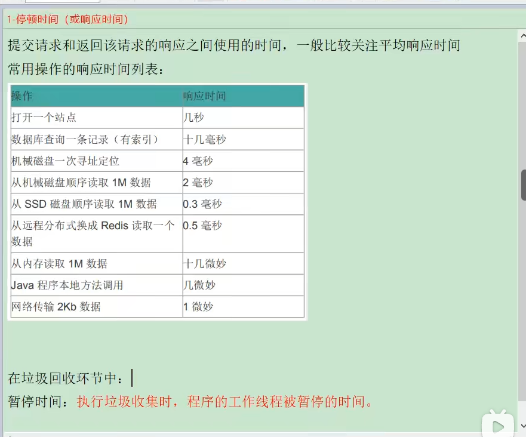
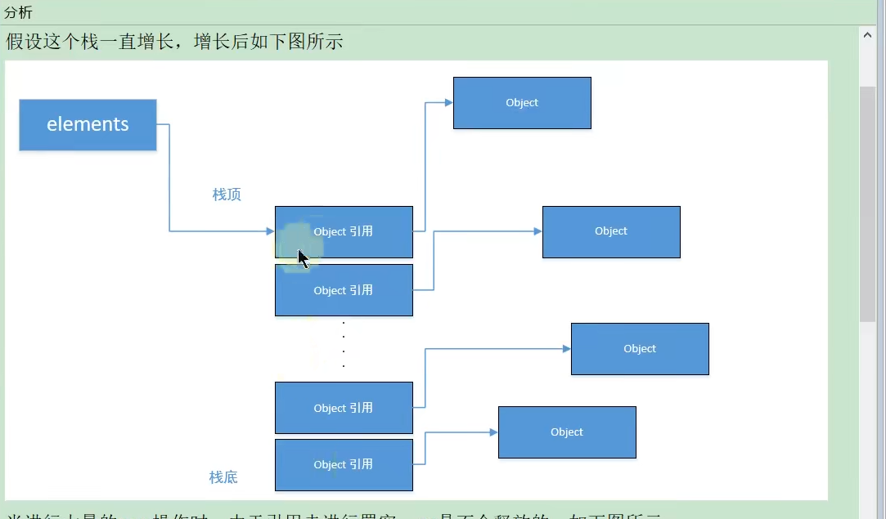
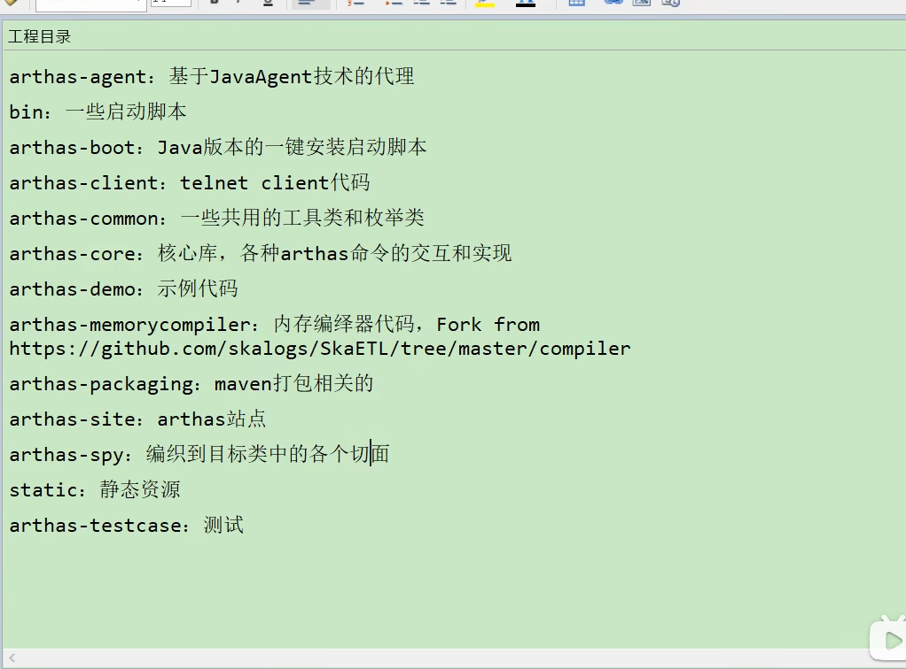

<!-- @import "[TOC]" {cmd="toc" depthFrom=1 depthTo=6 orderedList=false} -->

<!-- code_chunk_output -->

- [概述篇](#概述篇)
  - [一、大厂面试题](#一大厂面试题)
  - [二、背景说明](#二背景说明)
    - [生产环境中的问题](#生产环境中的问题)
      - [生产环境发生了内存溢出应该如何处理](#生产环境发生了内存溢出应该如何处理)
      - [生产环境应该给服务器分配多少内存合适](#生产环境应该给服务器分配多少内存合适)
      - [如何对垃圾回收器的性能进行调优](#如何对垃圾回收器的性能进行调优)
      - [生产环境CPU负载飙高该如何处理](#生产环境cpu负载飙高该如何处理)
      - [生产环境应该给应用分配多少线程合适](#生产环境应该给应用分配多少线程合适)
      - [不加log，如何确定请求是否执行了某一代码](#不加log如何确定请求是否执行了某一代码)
      - [不加log，如何实时查看某个方法的入参与返回值](#不加log如何实时查看某个方法的入参与返回值)
    - [为什么要调优](#为什么要调优)
      - [防止出现OOM](#防止出现oom)
      - [解决OOM](#解决oom)
      - [解决Full GC出现的频率](#解决full-gc出现的频率)
    - [不同阶段的考虑](#不同阶段的考虑)
      - [上线前](#上线前)
      - [项目运行阶段](#项目运行阶段)
      - [线上出现OOM](#线上出现oom)
  - [三、调优概述](#三调优概述)
    - [监控的依据](#监控的依据)
      - [运行日志](#运行日志)
      - [异常堆栈](#异常堆栈)
      - [GC日志](#gc日志)
      - [线程快照](#线程快照)
      - [堆转储快照](#堆转储快照)
    - [调优的大方向](#调优的大方向)
      - [合理地编写代码](#合理地编写代码)
      - [充分并合理地使用硬件资源](#充分并合理地使用硬件资源)
      - [合理地进行JVM调优](#合理地进行jvm调优)
  - [四、性能优化的步骤](#四性能优化的步骤)
    - [第1步(发现问题)：性能监控](#第1步发现问题性能监控)
      - [GC频繁](#gc频繁)
      - [cpu load过高](#cpu-load过高)
      - [OOM](#oom)
      - [内存泄漏](#内存泄漏)
      - [死锁](#死锁)
      - [程序响应时间较长](#程序响应时间较长)
    - [第2步(排查问题)：性能分析](#第2步排查问题性能分析)
      - [打印GC日志，通过GCviewer或者Http://gceasy.io来分析日志信息](#打印gc日志通过gcviewer或者httpgceasyio来分析日志信息)
      - [灵活运用命令行工具，jstack，jmap，jinfo等](#灵活运用命令行工具jstackjmapjinfo等)
      - [dump出堆文件，使用内存分析工具分析文件](#dump出堆文件使用内存分析工具分析文件)
      - [使用阿里Arthas，或jconsole，JVisualVM来实时查看JVM状态](#使用阿里arthas或jconsolejvisualvm来实时查看jvm状态)
      - [jstack查看堆栈信息](#jstack查看堆栈信息)
    - [第3步(解决问题)：性能调优](#第3步解决问题性能调优)
      - [适当增加内存，根据业务背景选择垃圾回收器](#适当增加内存根据业务背景选择垃圾回收器)
      - [优化代码，控制内存使用](#优化代码控制内存使用)
      - [增加及其，分散节点压力](#增加及其分散节点压力)
      - [合理设置线程池线程数量](#合理设置线程池线程数量)
      - [使用中间件提高程序效率，比如缓存，消息队列等](#使用中间件提高程序效率比如缓存消息队列等)
      - [其他......](#其他)
  - [五、性能评价](#五性能评价)
    - [1-停顿时间(或响应时间)](#1-停顿时间或响应时间)
    - [2-吞吐量](#2-吞吐量)
      - [对单位时间内完成的工作量(请求)的亮度](#对单位时间内完成的工作量请求的亮度)
      - [在GC中：运行用户代码的时间占总运行时间的比例(总运行时间：程序的运行时间+内存回收的时间)](#在gc中运行用户代码的时间占总运行时间的比例总运行时间程序的运行时间内存回收的时间)
    - [3-并发数](#3-并发数)
      - [同一时刻，对服务器有实际交互的请求数](#同一时刻对服务器有实际交互的请求数)
    - [4-内存占用](#4-内存占用)
      - [Java堆区所占的内存大小](#java堆区所占的内存大小)
    - [5-相互间的关系](#5-相互间的关系)
      - [以高速公路通行状况为例](#以高速公路通行状况为例)
- [JVM监控及诊断工具-命令行篇](#jvm监控及诊断工具-命令行篇)
  - [概述](#概述)
    - [简单命令行工具](#简单命令行工具)
  - [jps：查看正在运行的java进程](#jps查看正在运行的java进程)
    - [基本情况](#基本情况)
    - [测试](#测试)
    - [基本语法](#基本语法)
      - [options参数](#options参数)
      - [hostid参数](#hostid参数)
  - [jstat：查看JVM统计信息](#jstat查看jvm统计信息)
    - [基本情况](#基本情况-1)
    - [基本语法](#基本语法-1)
      - [options参数](#options参数-1)
        - [关于参数-gc](#关于参数-gc)
      - [interval参数 -用于指定输出统计数据的周期，单位为毫秒。即：查询间隔](#interval参数--用于指定输出统计数据的周期单位为毫秒即查询间隔)
      - [count参数 -用于指定查询的总次数](#count参数--用于指定查询的总次数)
      - [-t参数](#-t参数)
        - [可以在输出信息前加上一个Timestamp列，显示程序的运行时间。单位：秒](#可以在输出信息前加上一个timestamp列显示程序的运行时间单位秒)
        - [经验](#经验)
      - [-h参数 -可以在周期性数据输出时，输出多少行数据后输出一个表头信息](#-h参数--可以在周期性数据输出时输出多少行数据后输出一个表头信息)
    - [补充](#补充)
  - [jinfo：实时查看和修改JVM参数](#jinfo实时查看和修改jvm参数)
    - [基本情况](#基本情况-2)
    - [基本语法](#基本语法-2)
      - [查看](#查看)
      - [修改](#修改)
    - [拓展](#拓展)
  - [jmap：导出内存映像文件\&内存使用情况](#jmap导出内存映像文件内存使用情况)
    - [基本情况](#基本情况-3)
    - [基本语法](#基本语法-3)
    - [使用1：导出内存映像文件](#使用1导出内存映像文件)
      - [自动动的方式](#自动动的方式)
      - [手动的方式](#手动的方式)
    - [使用2：显示堆内存相关信息](#使用2显示堆内存相关信息)
      - [jmap -heap pid](#jmap--heap-pid)
      - [jmap -histo](#jmap--histo)
    - [使用3：其他作用](#使用3其他作用)
      - [jmap -permstat pid：看系统的ClassLoader信息](#jmap--permstat-pid看系统的classloader信息)
      - [jmap -finalizerinfo：查看堆积在finalizer队列中的对象](#jmap--finalizerinfo查看堆积在finalizer队列中的对象)
    - [小结](#小结)
  - [jhat：JDK自带堆分析工具](#jhatjdk自带堆分析工具)
    - [基本情况](#基本情况-4)
    - [基本语法](#基本语法-4)
  - [jstack：打印JVM中线程快照](#jstack打印jvm中线程快照)
    - [基本情况](#基本情况-5)
    - [基本语法](#基本语法-5)
  - [jcmd：多功能命令行](#jcmd多功能命令行)
    - [基本情况](#基本情况-6)
    - [基本语法](#基本语法-6)
  - [jstatd：远程主机信息收集](#jstatd远程主机信息收集)
- [JVM监控及诊断工具-GUI篇](#jvm监控及诊断工具-gui篇)
  - [工具概述：远程主机信息收集](#工具概述远程主机信息收集)
  - [jConsole](#jconsole)
    - [基本概述](#基本概述)
    - [启动](#启动)
    - [三种连接方式](#三种连接方式)
    - [主要作用](#主要作用)
  - [Visual VM：](#visual-vm)
    - [基本概述](#基本概述-1)
    - [插件的安装](#插件的安装)
    - [连接方式](#连接方式)
    - [主要功能](#主要功能)
  - [eclipse MAT](#eclipse-mat)
    - [基本概述](#基本概述-2)
    - [获取dump文件](#获取dump文件)
      - [dump文件内容](#dump文件内容)
      - [两点说明](#两点说明)
      - [获取dump文件](#获取dump文件-1)
    - [分析dump文件](#分析dump文件)
      - [histogram：展示了各个类的实例数目等](#histogram展示了各个类的实例数目等)
      - [thread overview](#thread-overview)
        - [查看系统的java进程](#查看系统的java进程)
        - [查看局部变量的信息](#查看局部变量的信息)
      - [获得对象相互引用的信息](#获得对象相互引用的信息)
        - [with outgoing reference](#with-outgoing-reference)
        - [with incoming reference](#with-incoming-reference)
      - [浅堆与深堆](#浅堆与深堆)
        - [shallow heap](#shallow-heap)
        - [retained heap](#retained-heap)
        - [补充：对象实际大小](#补充对象实际大小)
        - [练习](#练习)
        - [案例分析：StudentTrace](#案例分析studenttrace)
      - [支配树](#支配树)
    - [案例：Tomcat堆溢出分析](#案例tomcat堆溢出分析)
      - [说明](#说明)
      - [分析过程](#分析过程)
  - [补充1：再谈内存泄漏](#补充1再谈内存泄漏)
    - [内存泄漏的理解与分类](#内存泄漏的理解与分类)
    - [Java中内存泄漏的8种情况](#java中内存泄漏的8种情况)
      - [静态集合类](#静态集合类)
      - [单例模式](#单例模式)
      - [内部类持有外部类](#内部类持有外部类)
      - [各种连接，如数据库连接、网络连接和IO连接](#各种连接如数据库连接网络连接和io连接)
      - [变量不合理的作用域](#变量不合理的作用域)
      - [改变哈希值](#改变哈希值)
      - [缓存泄漏](#缓存泄漏)
      - [监听器和回调](#监听器和回调)
    - [内存泄漏的案例分析](#内存泄漏的案例分析)
      - [案例1：](#案例1)
        - [案例代码](#案例代码)
        - [分析](#分析)
        - [解决办法](#解决办法)
      - [案例2：](#案例2)
        - [案例代码](#案例代码-1)
        - [分析](#分析-1)
        - [解决办法](#解决办法-1)
  - [补充2：支持使用OQL语言查询对象信息](#补充2支持使用oql语言查询对象信息)
    - [SELECT子句](#select子句)
    - [FROM子句](#from子句)
    - [WHERE子句](#where子句)
    - [内置对象与方法](#内置对象与方法)
  - [JProfiler](#jprofiler)
    - [基本概述](#基本概述-3)
      - [介绍](#介绍)
      - [特点](#特点)
      - [主要功能](#主要功能-1)
    - [安装与配置](#安装与配置)
      - [下载与安装](#下载与安装)
      - [JProfiler中配置IDEA](#jprofiler中配置idea)
      - [IDEA配置JProfiler](#idea配置jprofiler)
    - [具体使用](#具体使用)
      - [数据采集方式](#数据采集方式)
        - [Instrumentation重构模式](#instrumentation重构模式)
        - [Sampling抽样模式](#sampling抽样模式)
      - [遥感检测Telemetries](#遥感检测telemetries)
      - [内存视图Live Memory](#内存视图live-memory)
      - [堆遍历heap walker](#堆遍历heap-walker)
      - [cpu视图cpu views](#cpu视图cpu-views)
      - [线程视图threads](#线程视图threads)
      - [监视器\&锁Monitors\&locks](#监视器锁monitorslocks)
    - [案例分析](#案例分析)
  - [Arthas](#arthas)
    - [基本概述](#基本概述-4)
      - [背景](#背景)
      - [概述](#概述-1)
      - [基于哪些工具开发而来](#基于哪些工具开发而来)
      - [官方使用文档 -Http://arthas.aliyun.com/zh-cn/](#官方使用文档--httparthasaliyuncomzh-cn)
    - [安装与使用](#安装与使用)
      - [安装](#安装)
      - [工程目录](#工程目录)
      - [启动](#启动-1)
      - [查看进程](#查看进程)
      - [查看日志 cat~/logs/arthas/arthas.log](#查看日志-catlogsarthasarthaslog)
      - [查看帮助 java -jar arthas-boot.jar -h](#查看帮助-java--jar-arthas-bootjar--h)
      - [web console](#web-console)
      - [退出](#退出)
    - [相关诊断与指令](#相关诊断与指令)
      - [基础指令](#基础指令)
      - [JVM相关](#jvm相关)
        - [dashboard](#dashboard)
        - [thread](#thread)
        - [jvm](#jvm)
        - [其它](#其它)
      - [class/classloader相关](#classclassloader相关)
        - [mc、redefine](#mcredefine)
        - [sc](#sc)
        - [sm](#sm)
        - [jad](#jad)
        - [classloader](#classloader)
      - [monitor/watch/trace相关](#monitorwatchtrace相关)
        - [stack](#stack)
        - [monitor](#monitor)
        - [trace](#trace)
        - [watch](#watch)
        - [tt](#tt)
      - [其他](#其他-1)
        - [profiler/火焰图](#profiler火焰图)
        - [options](#options)
  - [Java Mission Control](#java-mission-control)
    - [历史](#历史)
    - [启动](#启动-2)
    - [概述](#概述-2)
    - [功能：实时监控JVM运行时的状态](#功能实时监控jvm运行时的状态)
    - [Java Flight Recorder](#java-flight-recorder)
      - [事件类型](#事件类型)
      - [启动方式](#启动方式)
        - [方式1：使用-XX:StartFlightRecording=参数](#方式1使用-xxstartflightrecording参数)
        - [方式2：使用jcmd的JFR.\*子命令](#方式2使用jcmd的jfr子命令)
        - [方式3：JMC的JFR插件](#方式3jmc的jfr插件)
      - [Java Fight Recorder取样分析](#java-fight-recorder取样分析)
        - [代码](#代码)
        - [IO](#io)
  - [Btrace](#btrace)
  - [Flame Graphs(火焰图)](#flame-graphs火焰图)

<!-- /code_chunk_output -->

---
# 概述篇
## 一、大厂面试题
> 
> 
---
## 二、背景说明
### 生产环境中的问题
#### 生产环境发生了内存溢出应该如何处理
#### 生产环境应该给服务器分配多少内存合适
#### 如何对垃圾回收器的性能进行调优 
#### 生产环境CPU负载飙高该如何处理
#### 生产环境应该给应用分配多少线程合适
#### 不加log，如何确定请求是否执行了某一代码 
#### 不加log，如何实时查看某个方法的入参与返回值
### 为什么要调优
#### 防止出现OOM
#### 解决OOM
#### 解决Full GC出现的频率
### 不同阶段的考虑
#### 上线前
#### 项目运行阶段
#### 线上出现OOM
---
## 三、调优概述
### 监控的依据
#### 运行日志
#### 异常堆栈
#### GC日志
#### 线程快照
#### 堆转储快照
### 调优的大方向
#### 合理地编写代码
#### 充分并合理地使用硬件资源
#### 合理地进行JVM调优
---
## 四、性能优化的步骤
### 第1步(发现问题)：性能监控
>>> 
#### GC频繁
#### cpu load过高
#### OOM
#### 内存泄漏
#### 死锁
#### 程序响应时间较长
### 第2步(排查问题)：性能分析
>>> 
#### 打印GC日志，通过GCviewer或者Http://gceasy.io来分析日志信息
#### 灵活运用命令行工具，jstack，jmap，jinfo等
#### dump出堆文件，使用内存分析工具分析文件
#### 使用阿里Arthas，或jconsole，JVisualVM来实时查看JVM状态
#### jstack查看堆栈信息
### 第3步(解决问题)：性能调优
>>> 
#### 适当增加内存，根据业务背景选择垃圾回收器
#### 优化代码，控制内存使用
#### 增加及其，分散节点压力
#### 合理设置线程池线程数量
#### 使用中间件提高程序效率，比如缓存，消息队列等
#### 其他......
---
## 五、性能评价
### 1-停顿时间(或响应时间)
>>> 
>>> 
### 2-吞吐量
#### 对单位时间内完成的工作量(请求)的亮度
#### 在GC中：运行用户代码的时间占总运行时间的比例(总运行时间：程序的运行时间+内存回收的时间)
>>>> 吞吐量为1-1/(1+n)，-XX:GCTimeRatio=n
### 3-并发数
#### 同一时刻，对服务器有实际交互的请求数
### 4-内存占用
#### Java堆区所占的内存大小
### 5-相互间的关系
#### 以高速公路通行状况为例
---
---
# JVM监控及诊断工具-命令行篇
## 概述
>> 
### 简单命令行工具
>> 
>> 
## jps：查看正在运行的java进程
### 基本情况
>>> 
### 测试
### 基本语法
#### options参数
>>>> 
#### hostid参数
>>>> 
## jstat：查看JVM统计信息
### 基本情况
>>> 
>>> 
### 基本语法
#### options参数
>>>> 
>>>> 
##### 关于参数-gc
>>>>> 
#### interval参数 -用于指定输出统计数据的周期，单位为毫秒。即：查询间隔
#### count参数 -用于指定查询的总次数
#### -t参数
##### 可以在输出信息前加上一个Timestamp列，显示程序的运行时间。单位：秒
##### 经验
>>>>> 
#### -h参数 -可以在周期性数据输出时，输出多少行数据后输出一个表头信息
### 补充
>>> 
## jinfo：实时查看和修改JVM参数
### 基本情况
>>> 
>>> 
### 基本语法
>>> 
>>> 
>>> 
#### 查看
#### 修改
>>>> 
### 拓展
## jmap：导出内存映像文件&内存使用情况
>> 
### 基本情况
>>> 
### 基本语法
>>> 
>>> 
### 使用1：导出内存映像文件
>>> 
>>> 
#### 自动动的方式
>>>> 
#### 手动的方式
>>>> 
### 使用2：显示堆内存相关信息
>>>> 
#### jmap -heap pid
#### jmap -histo
### 使用3：其他作用
>>> 
#### jmap -permstat pid：看系统的ClassLoader信息
#### jmap -finalizerinfo：查看堆积在finalizer队列中的对象
### 小结
>>> 
## jhat：JDK自带堆分析工具
### 基本情况
>>> 
### 基本语法
>>> 
## jstack：打印JVM中线程快照
### 基本情况
>>> 
>>> 
### 基本语法
>>> 
>>> 
## jcmd：多功能命令行
>> 
### 基本情况
>>> 
### 基本语法
>>> 
>>> 
## jstatd：远程主机信息收集
>> 
---
---
# JVM监控及诊断工具-GUI篇
## 工具概述：远程主机信息收集
>> 
>> 
>> 
>> 
## jConsole
### 基本概述
>>> 
### 启动
>>> 
### 三种连接方式
>>> 
### 主要作用
## Visual VM：
### 基本概述
>>> 
### 插件的安装
>>> 
### 连接方式
>>> 
### 主要功能
>>> 
## eclipse MAT
>> 
### 基本概述
>>> 
>>> 
>>> 
### 获取dump文件
#### dump文件内容
>>> 
#### 两点说明
>>> 
#### 获取dump文件
>>> 
### 分析dump文件
>>> 
>>> 
#### histogram：展示了各个类的实例数目等
>>> 
#### thread overview
##### 查看系统的java进程
##### 查看局部变量的信息
#### 获得对象相互引用的信息
##### with outgoing reference
##### with incoming reference
#### 浅堆与深堆
##### shallow heap
>>>>> 
##### retained heap
>>>>> 
##### 补充：对象实际大小
>>>>> 
##### 练习
>>>>> 
##### 案例分析：StudentTrace
>>>>> 
#### 支配树
>>>> 
>>>> 
### 案例：Tomcat堆溢出分析
#### 说明
>>>> 
#### 分析过程
>>>> 
>>>> 
>>>> 
>>>> 
>>>> 
>>>> 
>>>> 
>>>> 
>>>> 
## 补充1：再谈内存泄漏
### 内存泄漏的理解与分类
>>> 
>>> 
>>> 
>>> 
>>> 
### Java中内存泄漏的8种情况
>>> 
#### 静态集合类
>>>> 
#### 单例模式
>>>> 
#### 内部类持有外部类
>>>> 
#### 各种连接，如数据库连接、网络连接和IO连接
>>>> 
#### 变量不合理的作用域
>>>> 
#### 改变哈希值
>>>> 
#### 缓存泄漏
>>>> 
#### 监听器和回调
>>>> 
### 内存泄漏的案例分析
>>> 
#### 案例1：
##### 案例代码
>>>>> 
##### 分析
>>>>> 
>>>>> 
##### 解决办法
#### 案例2：
##### 案例代码
>>>>> 
##### 分析
>>>>> 
>>>>> 
##### 解决办法
>>>>> 
## 补充2：支持使用OQL语言查询对象信息
>> 
### SELECT子句
>>> 
### FROM子句
>>> 
### WHERE子句
>>> 
### 内置对象与方法
>>> 
## JProfiler
>> 
### 基本概述
#### 介绍
>>>> 
#### 特点
>>>> 
#### 主要功能
>>>> 
### 安装与配置
#### 下载与安装
>>>> 
#### JProfiler中配置IDEA
>>>> 
#### IDEA配置JProfiler
>>>> 在插件市场安装同名插件，配置此程序的exe文件即可
### 具体使用
#### 数据采集方式
>>>> 
##### Instrumentation重构模式
##### Sampling抽样模式
#### 遥感检测Telemetries
#### 内存视图Live Memory
>>>> 
>>>> 
#### 堆遍历heap walker
#### cpu视图cpu views
#### 线程视图threads
>>>> 
#### 监视器&锁Monitors&locks
### 案例分析
## Arthas
### 基本概述
#### 背景
>>>> 
>>>> 
>>>> 
#### 概述
>>>> 
>>>> 
#### 基于哪些工具开发而来
>>>> 
#### 官方使用文档 -Http://arthas.aliyun.com/zh-cn/
### 安装与使用
>>> 
#### 安装
>>>> 
>>>> 
>>>> 
#### 工程目录
>>>> 
#### 启动
>>>> 
#### 查看进程
#### 查看日志 cat~/logs/arthas/arthas.log
#### 查看帮助 java -jar arthas-boot.jar -h
#### web console
>>>> 
#### 退出
>>>> 
### 相关诊断与指令
>>>> 
#### 基础指令
>>>> 
#### JVM相关
##### dashboard
##### thread
##### jvm
##### 其它
#### class/classloader相关
##### mc、redefine
##### sc
##### sm
##### jad
##### classloader
#### monitor/watch/trace相关
##### stack
##### monitor
##### trace
##### watch
##### tt
#### 其他
##### profiler/火焰图
##### options
## Java Mission Control
### 历史
>>> 
### 启动
>>> 
>>> 
### 概述
>>> 
### 功能：实时监控JVM运行时的状态
>>> 
### Java Flight Recorder
>>> 
>>> 
#### 事件类型
>>>> 
#### 启动方式
##### 方式1：使用-XX:StartFlightRecording=参数
##### 方式2：使用jcmd的JFR.*子命令
##### 方式3：JMC的JFR插件
#### Java Fight Recorder取样分析
##### 代码
##### IO    
## Btrace
## Flame Graphs(火焰图)
