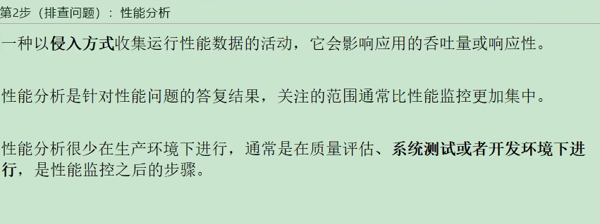
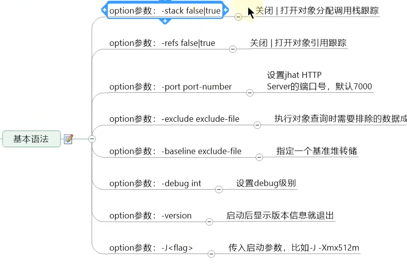
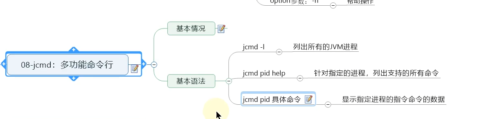

[toc]
---
# 概述篇
## 一、大厂面试题
> 
> 
---
## 二、背景说明
### 生产环境中的问题
#### 生产环境发生了内存溢出应该如何处理
#### 生产环境应该给服务器分配多少内存合适
#### 如何对垃圾回收器的性能进行调优 
#### 生产环境CPU负载飙高该如何处理
#### 生产环境应该给应用分配多少线程合适
#### 不加log，如何确定请求是否执行了某一代码 
#### 不加log，如何实时查看某个方法的入参与返回值
### 为什么要调优
#### 防止出现OOM
#### 解决OOM
#### 解决Full GC出现的频率
### 不同阶段的考虑
#### 上线前
#### 项目运行阶段
#### 线上出现OOM
---
## 三、调优概述
### 监控的依据
#### 运行日志
#### 异常堆栈
#### GC日志
#### 线程快照
#### 堆转储快照
### 调优的大方向
#### 合理地编写代码
#### 充分并合理地使用硬件资源
#### 合理地进行JVM调优
---
## 四、性能优化的步骤
### 第1步(发现问题)：性能监控
>>> 
#### GC频繁
#### cpu load过高
#### OOM
#### 内存泄漏
#### 死锁
#### 程序响应时间较长
### 第2步(排查问题)：性能分析
>>> 
#### 打印GC日志，通过GCviewer或者Http://gceasy.io来分析日志信息
#### 灵活运用命令行工具，jstack，jmap，jinfo等
#### dump出堆文件，使用内存分析工具分析文件
#### 使用阿里Arthas，或jconsole，JVisualVM来实时查看JVM状态
#### jstack查看堆栈信息
### 第3步(解决问题)：性能调优
>>> 
#### 适当增加内存，根据业务背景选择垃圾回收器
#### 优化代码，控制内存使用
#### 增加及其，分散节点压力
#### 合理设置线程池线程数量
#### 使用中间件提高程序效率，比如缓存，消息队列等
#### 其他......
---
## 五、性能评价
### 1-停顿时间(或响应时间)
>>> 
>>> 
### 2-吞吐量
#### 对单位时间内完成的工作量(请求)的亮度
#### 在GC中：运行用户代码的时间占总运行时间的比例(总运行时间：程序的运行时间+内存回收的时间)
>>>> 吞吐量为1-1/(1+n)，-XX:GCTimeRatio=n
### 3-并发数
#### 同一时刻，对服务器有实际交互的请求数
### 4-内存占用
#### Java堆区所占的内存大小
### 5-相互间的关系
#### 以高速公路通行状况为例
---
---
# JVM监控及诊断工具-命令行篇
## 概述
>> 
### 简单命令行工具
>> 
>> 
## jps：查看正在运行的java进程
### 基本情况
>>> 
### 测试
### 基本语法
#### options参数
>>>> 
#### hostid参数
>>>> 
## jstat：查看JVM统计信息
### 基本情况
>>> 
>>> 
### 基本语法
#### options参数
>>>> 
>>>> 
##### 关于参数-gc
>>>>> 
#### interval参数 -用于指定输出统计数据的周期，单位为毫秒。即：查询间隔
#### count参数 -用于指定查询的总次数
#### -t参数
##### 可以在输出信息前加上一个Timestamp列，显示程序的运行时间。单位：秒
##### 经验
>>>>> 
#### -h参数 -可以在周期性数据输出时，输出多少行数据后输出一个表头信息
### 补充
>>> 
## jinfo：实时查看和修改JVM参数
### 基本情况
>>> 
>>> 
### 基本语法
>>> 
>>> 
>>> 
#### 查看
#### 修改
>>>> 
### 拓展
## jmap：导出内存映像文件&内存使用情况
>> 
### 基本情况
>>> 
### 基本语法
>>> 
>>> 
### 使用1：导出内存映像文件
>>> 
>>> 
#### 自动动的方式
>>>> 
#### 手动的方式
>>>> 
### 使用2：显示堆内存相关信息
>>>> 
#### jmap -heap pid
#### jmap -histo
### 使用3：其他作用
>>> 
#### jmap -permstat pid：看系统的ClassLoader信息
#### jmap -finalizerinfo：查看堆积在finalizer队列中的对象
### 小结
>>> 
## jhat：JDK自带堆分析工具
### 基本情况
>>> 
### 基本语法
>>> 
## jstack：打印JVM中线程快照
### 基本情况
>>> 
>>> 
### 基本语法
>>> 
>>> 
## jcmd：多功能命令行
>> 
### 基本情况
>>> 
### 基本语法
>>> 
>>> 
## jstatd：远程主机信息收集
>> 
---
---
# JVM监控及诊断工具-GUI篇
## 工具概述：远程主机信息收集
## jConsole
## Visual VM：
## eclipse MAT
## JProfiler
## Arthas
## Java Mission Control
## Btrace
## Flame Graphs(火焰图)
