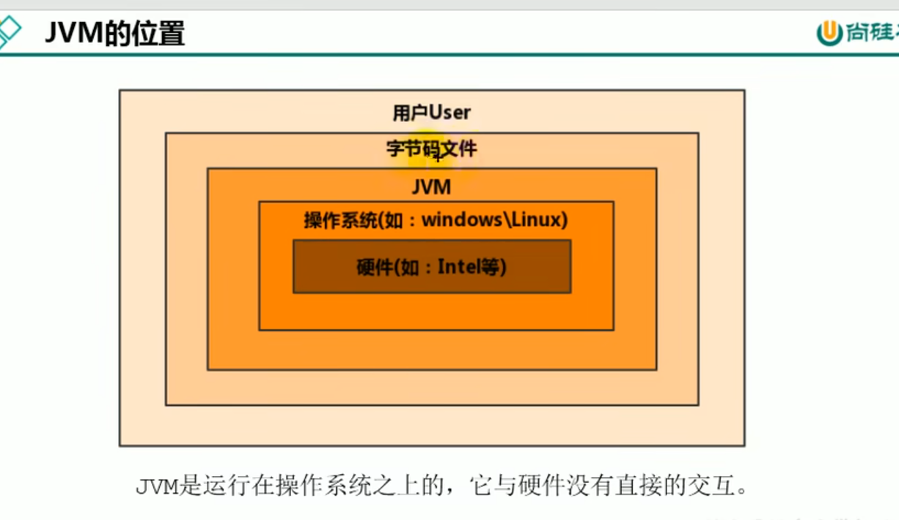
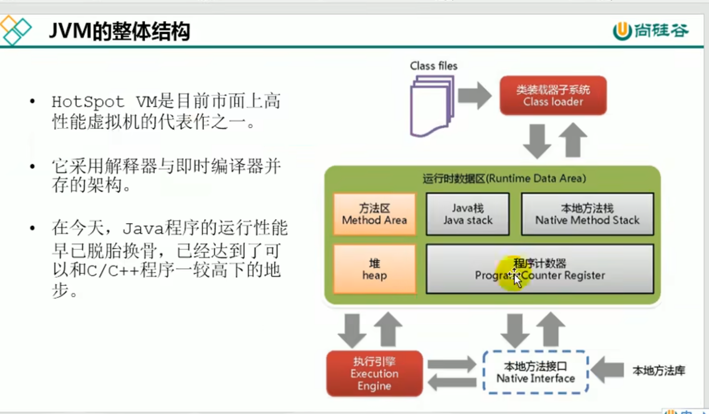
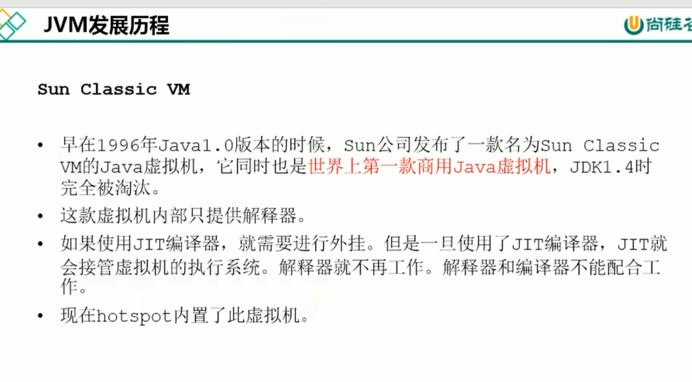
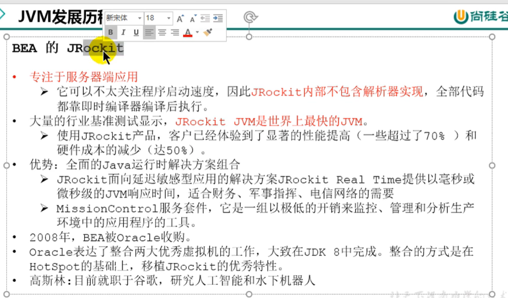
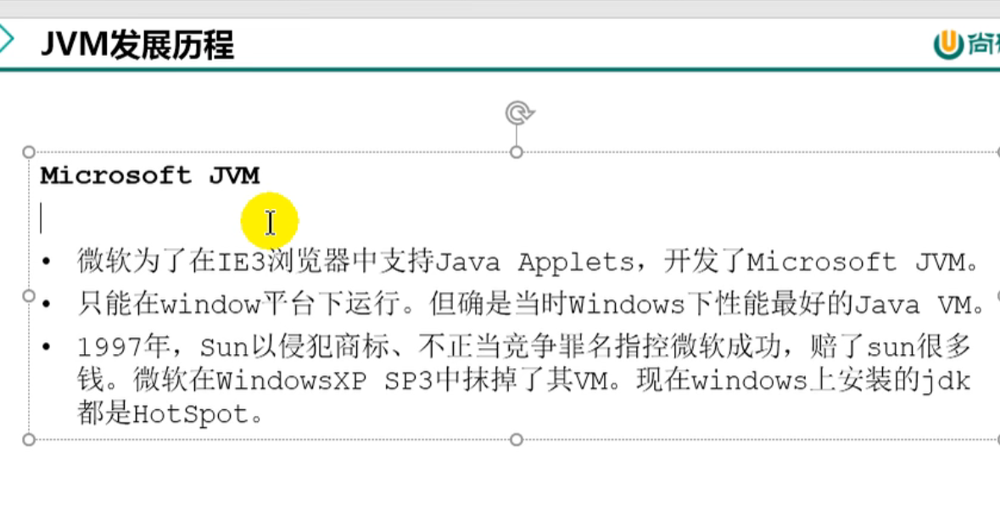
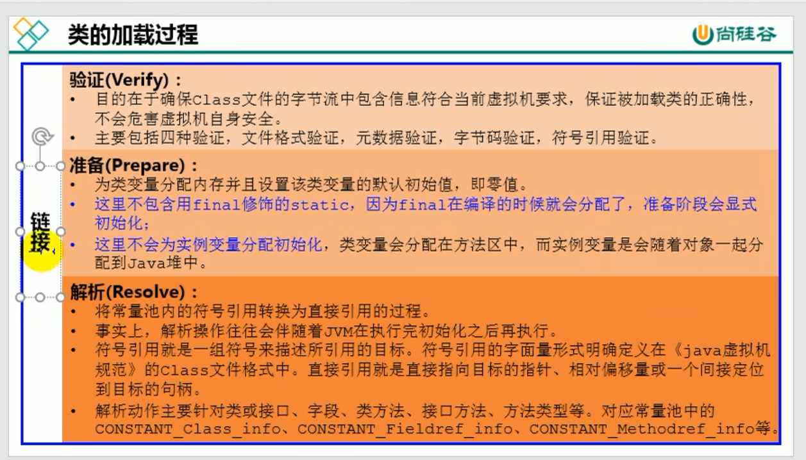

[toc]
# 第一章、JVM与java体系结构
## 前置：java的执行流程

## 一、JVM的位置
> 
> 
## 二、JVM的整体结构
> 
## 三、JVM的架构模型
> 
> 
## 四、JVM的生命周期
> 
> 
## 五、JVM的发展历程
> 
> 
> 
>>- #### HotSpot虚拟机
>>> 
>>>
> 
> 
> 
> 
> 
> 
> 
> 
> 
> 
---
# 第二章、类加载子系统
> 
> 
> 
## 1.类加载器
>> 
>> 
>> 
>> 
### (1)Loading
>>> 
>>> 
### (2)Linking
>>> 
### (3)Initialization
>>> 
