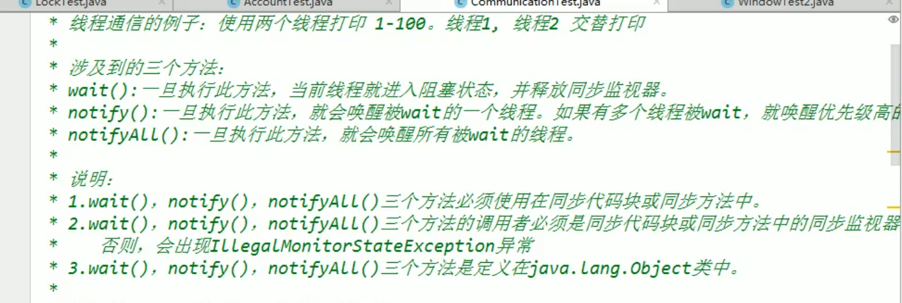

[toc]

# 一、JDK、JRE、JVM的关系
    (1)JDK(java开发工具包)=JRE(java运行环境)+开发工具集(例如javac编译工具)
    (2)JRE=JVM(java虚拟机)+javase核心类库

# 二、Java程序的编写、编译、运行
    (1)编写java代码以.java格式保存在源文件中
    (2)使用“javac 源文件名.java"命令编译java源文件,编译成字节码文件(.class)
    (3)使用“java 类名”运行字节码文件

# 三、一个java源文件中最多只能有一个类声明为public，而且要求声明为public的类的类名必须与源文件名相同；一个java源文件有几个类名就生成几个字节码文件

# 四、IDE(集成开发环境)

# 五、标识符和关键字
    1. Java的类名、变量名以及方法明都被称为标识符
    2. 所有的标识符都应该以字母、美元符号$、或下划线_开始,但首字符之后可以是字母、美元符、下划线或数字的任何字符组合
    3. 不能使用关键字作为变量名和方法名
    4. 标识符是大小写敏感的，大小写字母的标识符表示的是不同的标识符

# 六、变量定义在作用域内，出了作用域就失效

# 七、Java的数据类型
    1.Java的数据类型分为两大类，分别是基本类型（primitive type）和引用类型（reference type）
    2.基本类型有
        (1)整型（int-4个字节、byte-1个字节、short-2个字节、long-8个字节-变量值需要在后面加L，不加则声明为int类型）
        (2)浮点类型（float-4个字节-变量值需要在后面加F(不加则报错)、double-8个字节）-存在舍入误差，值接近但不等于，所以要避免使用浮点数进行比较
        (3)字符类型（char-2个字节）
        (4)布尔（boolean-占1个位）类型（true和false）
    3.引用类型(只存放null或地址值)有
        类（class）：如String类型，String可以和8种基本数据类型变量做运算，结果都是String类型，都是连接运算；
        接口（interface）；
        数组（array）。
    4.类型转换(不能转换布尔值、不能把对象类型转换为不相干的类型、操作较大的数时，需要注意溢出问题)
        (1)强制转换 （高容量→低容量-防止内存溢出） 浮点型强制转整形会截断， 可能导致损失精度
        (2)自动转换 （低容量→高容量） byte、char、short、int之间相互自动转换最终结果为int型，得用int或以上容量的数据类型接收。

# 八、进制表示
    1.二进制0b开头、八进制0开头、十六进制0x开头；正数：三码一样；负数，反码是对原码按位取反，补码是反码加一
    2.计算机底层都以补码的方式存储数据
    3.进制转换方法
        (1)转换成二进制toBinaryString(int i)
        (2)转换成八进制toOctalString(int i)
        (3)转换成十六进制toHexString(int i)

# 九、运算符
    1.位运算符：<<等价于 *2，>>等价于/2(2<<3等价于2*(2^3))
    2.条件运算符(三元运算符)：，凡是可以使用三元运算符的结构都可以转换成if结构，反之则不成立

    3.自增“++”不会改变本身变量的数据类型
    4.“+= -= *= /="不会也不能改变本身变量的数据类型
    5.instanceof
    6.逻辑运算符

# 十、Scanner类
    1.Scanner没有提供获取char型的方法

# 十一、if-else if-else
    1.如果多个条件表达式之间是互斥关系，则声明执行语句的位置无所谓。
    2.如果是条件之间是交集关系，则需要根据实际情况来决定执行语句的先后顺序
    3.如果是包含的关系，通常应该将范围小的首先去声明在范围大的条件之前，否则范围小的条件执行语句就无法执行

# 十二、MATH.Random()
    1.返回值默认为double类型
    2.默认范围：[0.0,1.0)

# 十三、switch-case
    1.判断成功后如果没有break会不再判断后面的条件且继续执行后面的语句
    2.判断条件只能是byte、short、int、char、String类型、枚举类型
    3.既可使用if语句又可使用switch语句时，优先使用switch，因为switch执行效率更高
    4.凡是可以使用switch语句的结构都可以转换成if结构，反之则不成立

# 十四、循环
    1.要素：
        (1)初始化条件
        (2)循环条件
        (3)循环体
        (4)迭代条件：不写迭代条件可能导致死循环
    2.通常情况下，循环结束都是因为循环条件返回false
    3.算法上：有限性
    4.break和continue
        (1)相同点：关键字后面不能声明执行语句
        (2)不同点：break结束当前循环；continue结束当次循环
        (3)使用范围：break使用在switch和循环结构中；continue只能使用在循环结构中
        (4)特殊用法：
            *1.
            *2.

# 十五、数组
    1.数组本身就是对象，java中对象是在堆中的，因此数组无论保存原始类型还是其他对象类型，数组对象本身是在堆中的
    2.数组是引用类型
    3.初始化： 、 一旦数组初始化完成，其长度就确定了
    4.初始化值：
        (1)整形：0
        (2)浮点型：0.0
        (3)字符型：0 但是输出不显示
        (4)布尔型：false
        (5)引用数据类型：null
    5.从数组底层运行机制来看，其实没有多维数组，二维数组是将一个数组作为元素存入到另一个数组中去，多维数组以此类推，多维数组初始化：
    6.多维数组的长度是其行数，因为多维数组还是存放元素为数组地址的数组，多维数组初始化外层元素的初始化值为地址值，内层元素与一维数组一致
    7.数组分类：
        (1)按数组维数
        (2)按数组存放的元素的类型：基本数据类型和引用数据类型
    8.数组的复制
        (1)将变量等于某个数组变量，不能称为数组的复制

# 十六、内存
    1.堆：
        (1)new对象(例如数组)
        (2)可以被所有的线程共享，不会存放别的对象引用
    2.栈：
        (1)基本对象类型(包含具体数值)
        (2)引用对象的变量(存放此引用在堆里面的具体地址)
    3.方法区：
        (1)包含所有的class和static变量还有常量池

# 十七、数据结构与算法
    (一)数据结构
        1.数据与数据之间的逻辑关系：
            (1)集合
            (2)一对一
            (3)一对多
            (4)多对多
        2.数据的存储结构
            (1)线性表：顺序表(比如：数组)、链表、栈、队列
            (2)树形结构：二叉树
            (3)图形结构
    (二)算法
        算法的五大特征：
            (1)输入
            (2)输出
            (3)有穷性
            (4)确定性
            (5)可行性
        1.排序算法
            (1)排序算法的优劣：
            (2)排序算法分类：
                *1.内部排序
                *2.外部排序
            (3)十大内部排序算法
                *1.选择排序：直接选择排序、堆排序
                *2.交换排序：冒泡排序、快速排序
                *3.插入排序：直接插入排序、折半插入排序、Shell排序
                *4.归并排序
                *5.桶式排序
                *6.基数排序
        2.搜索算法
            (1)二分查找，前提是查找的数组有序

# 十八、java.util.Arrays类(操作数组的工具类)  
    1.boolean equals(int[] a,int[] b)比较两个数组是否相等
    2.String toString(int[] a)输出数组信息
    3.void fill(int[] a,int val)将指定值填充到数组中(全部替换)
    4.void sort(int[] a)对数组进行排序
    5.int binarySearch(int[] a,int key)对有序数组二分查找

# 十九、异常

# 二十、面向对象编程(OOP)
    
    1.本质：以类的方式组织代码，以对象的组织(封装)数据
    2.三大特性：
        (1)封装：
            体现：
                *1.将类的属性私有化(private)，同时，提供公共(public)的方法来获取(get)和设置(set)属性的值
                *2.私有方法在类里内部调用
                *3.修饰符权限：
                可以修饰 类和类的内部结构：属性、方法、构造器、内部类(不能修饰代码块)  ，但类只能用缺省和public修饰；不同包下的子类指A包的类继承了B包的类
        (2)继承：
            *1.Java中 类 只有单继承，没有多继承，继承了属性和方法(包括私有的属性和方法，但是因为封装性的影响，使得子类不能直接调用父类的结构)
            *2.减少了代码的冗余；便于功能的拓展；是多态的前提
            *3.super() 调用父类的构造器必须放在子类构造器的第一行 this() 同理----只能用一个
            *4.super() 只能出现在子类的方法或构造方法中
            *5.重写：
                ^1.需要有继承关系
                ^2.方法名、参数列表必须相同
                ^3.重写的方法使用的访问权限不能小于父类的，方法返回值数据类型的范围不能大于父类的，如果是A类型，那么返回值类型只能是A类或者A类的子类，如果是被重写方法的返回值是基本数据
                类型，那么重写方法的返回值类型只能和被重写的方法一致。
                ^4.抛出异常范围可以缩小，但不能扩大(不能大于父类被重写的方法抛出的异常类型)
                ^5.private修饰的方法不能被重写
                ^6.static修饰的方法不能被重写，子类和父类的同名同方法要被都声明为非static(考虑重写)，要么都声明为static(不是重写)
            *6.继承的父类的父类及再往上的父类叫做间接父类
            *7.子类创建对象虽然会调用父类的空参构造器直到调用到Object类的空参构造器，但是创建的对象只有new出来的这个
        (3)多态
            *1.多态是方法的多态，没有属性的多态(调用属性取决于等号左边的引用类型)
            *2.条件：继承关系、方法需要重写、父类引用指向子类对象
            *3.虚拟方法调用，编译期调用父类方法(等号左边的类型)，执行期调用的是子类重写的父类的方法(等号右边的类型)，属性(成员变量)不具备这一特性(只取决于左边)，且不能调用子类特有的方法，可以通过向下转型(
                强制类型转换(可能出现ClassCastException异常，可以通过"a instanceof A"来判断a是否是A的实例，是 返回true，否 返回false)
                )处理后再来调用
            *4.对象的多态性：父类的引用指向子类的对象
    3.两个要素：类和对象
        (1)面向对象程序设计的重点是类的设计
        (2)设计类，就是设计类的成员
    4.构造器(构造方法)
        (1)使用构造器创建对象
        (2)初始化对象的值
        (3)使用 new关键字必须有构造器
        (4)没有返回值(没有数据类型)
        (5)显示定义构造器后，系统不在提供默认的空参构造器
        (6)构造器权修饰符取决于类的权限修饰符
    5.成员变量和局部变量的区别
        (1)相同点：
            *1.定义变量的格式
            *2.先声明后使用
            *3.变量都有其对应的作用域
        (2)不同点：
            *1.在类中声明的位置不同
                成员变量直接定义在类的{}内；
                局部变量声明在方法内、方法形参、代码块内、构造器形参、构造器内部的变量
            *2.关于权限修饰符的不同
                成员变量可以在声明时指明其权限，使用权限修饰符
                例如private、public、protected、缺省；
                局部变量不可以使用除了final关键字之外的权限修饰符
            *3.初始化值情况不同
                成员属性有成员初始化值；
                局部变量没有默认初始化值
            *4.在内存中加载的位置不同
                成员属性：记载到堆空间中(非static修饰)
                局部变量：加载到栈空间中
    6.成员变量(属性)赋值的先后顺序：默认初始化=>显示初始化/在代码块中赋值(取决于代码块和显示初始化声明的先后位置)=>构造器初始化=>创建对象后，调用"对象.属性=xxx"赋值
    7.匿名对象只能调用一次
    8.重载
            同种数据类型的可变个数形参和数组形参不构成重载，且可变个数形参在方法的形参中，必须声明在最后
    9.JavaBean
            (1)符合以下标准的java类：
                *1.类是公共的
                *2.有一个无参的公共的构造器
                *3.有属性，且有对应的get、set方法
    9.UML图：
    10.interface接口：
        JDK7之前：
            (1)定义的变量默认都是public static final 全局常量
            (2)定义的方法默认都是public abstract 抽象方法
        JDK8：除了定义全局常量和抽象方法之外，还可以定义静态方法、默认方法
            (1)静态方法：继承接口的类的实例对象不能调用，只能通过接口调用
            (2)默认方法：通过继承接口的类的实例对象来调用；可以重写；
                *1.如果子类(实现类)继承的父类和实现的接口中声明了同名同参数的默认(default)方法，子类在没有重写方法的情况下，优先调用父类的方法=>类优先原则
                *2.如果实现类实现了多个接口，而这多个接口中都定义了同名同参数的默认(default)方法，在实现类没有重写此方法的情况下，报错=> 接口冲突  => 必须在实现类中重写此方法
                *3.实现类中调用接口中的默认方法：接口名.super.方法名
    11.内部类
        (一)成员内部类：
            (1)可以被继承
            (2)可以被abstract修饰
            (3)可以调用外部类的结构
            (4)可以被static修饰
            (5)可以修饰权限(public等)
            (6)实例化：
        (二)局部内部类(方法内、代码块内、构造器内)
            (1)如果在局部内部类(声明在外部类方法中)的方法中调用声明在外部类的局部变量(和内部类声明在同一个外部类方法中)的话，要求此局部变量声明为final的

# 二十一、方法
    1.可以在方法内使用另一个方法，但是不能定义另一个方法

# 二十二、递归
    1.实质：在一个方法体内调用它自身

# 二十三、关键字
    (一)this关键字
        1.可以修饰属性、方法、构造器
        2.修饰方法和构造器可以调用重载的同名方法或构造器,调用构造器this()时必须在构造器里的首行
        3.在构造器中，和"super()"只能二选一，如果都没有显式的声明，则默认调用父类的空参构造器super()；如果有多个构造器，则至少有一个调用了父类的空参构造器
    (二)import关键字
        1.如果使用java.lang包下定义的类或接口，则可以省略import结构
        2.如果使用不同包下的同名类，则至少有一个类需要全类名展示
        3.如果使用了"XXX.*"，需要使用这个包下的子包仍需要重新导入
        4.static 修饰静态导入，可以直接省略某个静态类的类名而直接调用其方法(前提：方法是静态方法，而且必须落脚点必须是指定类或者接口的结构，比如："import static XXX.*")
    (三)static关键字
        1.可以修饰属性、方法、代码块、内部类
        2.类变量(静态变量)
            (1)属于成员变量
            (2)随着类加载而加载，早于对象的创建
            (3)可以直接"类名.变量名"调用
            (4)内存位置：存在方法区(包括 类的加载信息、静态域、常量池)的静态域中
            (5)使用场景：属性被多个对象所共享的，不会随着对象不同而不同则可以声明为静态属性
        3.类方法(静态方法)
            (1)随着类加载而加载
            (2)静态方法中，只能调用静态的方法和属性；非静态方法中，既可以调用非静态方法和属性，也可以调用静态的方法和属性
            (3)可以直接"类名.方法名()"调用
            (4)使用场景：
                *1.操作静态属性的方法通常是静态方法
                *2.工具类中的方法通常声明为静态方法
        4.静态代码块
            (1)静态代码块和非静态代码块的区别：
                *1.静态代码块随着类的加载而执行且只执行一次；初始化类的静态属性；静态代码块内只能调用静态的属性和静态的方法，不能调用非静态的结构
                *2.非静态代码块随着对象的创建而执行，每创建一个对象就执行一次；创建对象时可以对属性等进行初始化；非静态代码块内既能调用静态的属性和静态的方法，也能调用非静态的结构
                *3.静态代码块的执行要优先于非静态代码块
            (2)静态代码块和非静态代码块相同点：内部可以有输出语句
            (3)同一个类中有多个静态代码块，执行顺序取决于代码块声明的先后位置
    (四)final关键字
        1.可以修饰类、方法、变量
        2.final修饰类：此类不能被其他类继承：例如：String类
        3.final修饰方法：此方法不能被重写： 例如：Object类的getClass()方法
        4.final修饰变量：此时的变量成为一个常量，不能再被改变；final修饰的变量作为形参时，传入的实参不可再被操作修改，只能调用
        5.static final： 用来修饰属性，成为全局常量；用来修饰方法，直接通过类调用且不能被重写

# 二十四、MVC设计模式
    1.model 模型层：主要处理数据
    2.controller 控制层： 处理业务逻辑
    3.view 视图层： 显示数据

# 二十五、Object类
    1.所有的类都是间接或直接继承自Object类
    2.Object类只声明了一个空参的构造器
    3.Object类中的功能、属性、方法具有通用性
    4.toString()方法：当我们输出一个对象的引用时，其实是调用了当前对象的toString()方法
    5.==和equals()的区别
        (1)==可以使用在
            *1.基本数据类型(比较数值是否相等且类型不一定要相等/不能比较boolean型)
            *2.引用数据类型(比较两者地址值是否相同，即是否指向堆中相同的对象实体)
        (2)equals()是一个方法，而非运算符，只适用于引用数据类型：
                *1.Object中的equals()与==作用相同
                *2.某些类中(String、Date、File、包装类)重写了equals()方法，重写后比较的不是地址值，而是引用的实体内容，所以通常情况下，自定义的类想要用equals()方法比较实体内容是否相等，就需要我们自己重写从Object中继承的equals()方法

# 二十六、Wrapper包装类
    1.java提供了8种基本数据类型对应的包装类，使得基本数据类型的变量具有类的特征
    2.转换方法
        (1)包装类转换为基本数据类型的方法：
            *1.调用方法xxxValue()
            *2.自动拆箱: int i = integer;   //JDK5.0新特性
        (2)基本数据类型转换为包装类：
            *1.调用包装类的构造器： new Integer(int i);
            *2.自动装箱： Integer i = int;   //JDK5.0新特性
        (3)基本数据类型和包装类转换为String类型：
            *1.调用String.valueOf()
        (4)String类型转换为基本数据类型:
            *1.调用包装类的parseXxx()方法，要注意String的值是否可以转换成对应类型，否则会报NumberFormatException异常
        (5)String类型转换为包装类
            *1.调用包装类的构造器： new Integer(int i);

# 二十七、设计模式
    开闭原则：对拓展开放，对修改封闭
    (一)单例模式：采取一定的方式保证在整个系统软件中，对某个类只能存在一个对象实例(静态方法返回静态对象)，
        好处：驻存在内存中，生命周期长，需要使用时直接可调用
        1.饿汉式：一开始就new 好处：是线程安全的 弊端：对象加载时间过长
        2.懒汉式：判断条件再new 好处：延迟对象的创建 弊端：线程安全需要特别编写
    (二)代理模式
        应用场景：
            1.安全代理：屏蔽对真是角色的直接访问
            2.远程代理：通过代理类处理远程方法调用(RMI)
            3.延迟加载：先加载轻量级的代理对象，真正需要再加载真实对象
        分类：
            1.静态代理：
            2.动态代理
    (三)工厂方法模式
    (四)抽象工厂模式
# 二十八、main()方法
    1.是程序的入口也是一个普通的静态方法
    2.可以作为我们与控制台交互的方式

# 二十九、异常
    (一)Error：java虚拟机无法解决的严重问题，如JVM系统内部错误、资源耗尽等严重情况，例如栈溢出(StackOverflowError)、堆溢出(OutOfMemoryError)，一般不编写代码进行处理
    (二)Exception：其他因编程错误或偶然的外在因素导致的一般性问题，可以使用针对性的代码进行处理
        (1)编译时异常(checked)
            *1.IOException
                *(1)FileNotFoundException
            *2.ClassNotFoundException
        (2)运行时异常(unchecked)
            *1.NullPointerException
            *2.ArrayIndexOutException
            *3.NumFormatException
            *4.InputMismatchException(输入不匹配)
            *5.ArithmaticException(算数异常 eg:数值除以0)
            *6.ClassCastException(类型转换异常)
    (三)异常的处理：
        1.抛：程序正常运行过程中，一旦出现异常，就会在异常代码处生成一个对应异常类的异常对象，并将此对象抛出，其后代码就不在执行
        2.抓：
            (1)try-catch-finally：
                *1.finally根据使用需求可选择用不用
                *2.一旦try中的异常对象在匹配到某一个catch时，就进入catch中进行异常的处理。一旦处理完成就跳出当前的try-catch结构(没有写finally情况下),继续执行其后的代码
                *3.catch中的异常类型如果没有子父类的关系，则谁声明先后没有所谓；如果存在子父类关系，则子类一定要声明在父类之前，否则报错
                *4.常用的异常对象处理方式：
                    *(1)String getMessage()
                    *(2)printStackTrace()
                *5.try中声明的变量，除了try结构后就不能再被调用
                *6.使用try-catch-finally是将一个编译时可能出现的异常延迟到运行时出现
                *7.finally声明的是一定会被执行的代码，即使在 catch中又出现异常了、try中有return语句、catch中有return语句等情况下，finally中的语句也一定会被执行
                *8.像数据库链接、IO流、网络编程Socket、JVM等资源是不能被自动回收的，需要我们手动地释放资源，就需要声明在finally中
                *9.try-catch-finally可以嵌套
                *10.由于运行时异常比较常见，所以一般不考虑使用try-catch-finally结构，但是编译时异常一定要考虑异常的处理
            (2)throws
                *1.写在方法声明处，指明此方法执行时可能会抛出的类型，一旦当方法体执行时，出现异常，仍会在异常代码处生成一个异常类的对象，此对象满足throws异常的类型时，就会被抛出
            (3)
                *1.try-catch-finally是将异常真正的处理掉了
                *2.throws的方式只是将异常抛给了方法的调用者，并没有真正将异常处理掉
            (4)开发中如何选择try-catch-finally和throws：
                *1.如果父类被重写的方法没有throws方式处理异常，则子类重写的方法也不能使用throws方式处理异常，意味着子类如果重写的方法有异常，必须使用try-catch-finally进行处理
                *2.执行的方法a中，先后调用了另外的几个方法，这几个方法是递进关系执行的，就更建议使用throws的方式处理，而执行的方法a可以考虑用try-catch-finally方式进行处理

# 三十、多线程
    (一)创建多线程的方式
        Thread类
            1使用：
                *1.创建一个继承Thread的子类
                *2.重写Thread类的run()方法
                *3.创建Thread子类的对象
                *4.通过此对象调用start()方法
            2.常用方法
                *1.start()方法
                    *(1)启动一个线程
                    *(2).调用当前线程的run()方法
                *2.run()
                    *(1)直接调用run()方法不会多分一个线程，仅仅视为创建对象在方法中调用
                    *(2)通常需要重写Thread类中的此方法，将创建线程需要的操作声明在此方法中
                *3.currentThread() -静态方法，返回当前代码执行的线程
                *4.getName() -获取当前线程的名字
                *5.setName() -设置当前线程的名字
                *6.yield() -释放当前cpu的执行权
                *7.join() -在线程中调用线程b的join()，此时线程a进入阻塞状态，线程b完全执行完以后，线程a才结束阻塞状态
                *8.sleep(long millis) 静态方法，令当前活动线程在指定时间段内放弃对cpu的控制，在此期间线程为阻塞状态，使其他线程有机会被执行，时间到后重新排队
                *9.stop() -强制线程生命期结束，不推荐使用
                *10.isAlive() -判断当前线程是否存活
        Runnable接口
            1.使用
                *1.创建一个实现了Runnable接口的实现类
                *2.实现类去实现Runnable接口中的抽象方法run()
                *3.创建实现类的对象
                *4.将此对象作为参数传递到Thread类的构造器中，创建Thread类的对象
                5.通过Thread类的对象调用start()
        Callable接口
            1.使用：
                *1.创建一个实现了Callable接口的实现类
                *2.实现类去实现Runnable接口中的抽象方法call()
                *3.创建实现类的对象
                *4.将此对象作为参数传递到FutureTask类的构造器中，创建FutureTask类的对象
                *5.调用FutureTask.get()获取返回值,此返回值是Callnable接口实现类的call方法的返回值(此步看情况省略)
                *6.将FutureTask的对象作为参数传递到Thread类的构造器中，创建Thread类的对象
                *7.通过Thread类的对象调用start()
            2.Callable接口比Runnable接口强大的地方
                *1.call()方法有返回值
                *2.call()可以抛出异常，被外面的操作捕获，获取异常信息
                *3.Callable支持泛型
        线程池：
            1.使用：
            corePoolSize:核心池大小
            maximumPoolSize:最大线程数
            keepAliveTime:线程没有任务时最多保持多长时间会终止
            2.使用线程池的好处：
                *1.提高了响应速度(减少了创建新线程的时间)
                *2.降低了资源消耗(重复利用线程池中的线程资源，不需要每次都重新创建)
                *3.便于线程管理
    (二)继承Thread类和实现Runnable接口的区别和选择：
        1.开发中：优先选择实现Runnable接口的方式，
        -原因：
            (1)实现的方式没有单继承的局限性
            (2)实现的方式更适合来处理多个线程共享数据的情况
        -联系：Thread是实现了Runnable接口的类
        2.相同点：两种方式都需要重写run()方法，将线程需要执行的逻辑声明在run()方法中
    (三)注意事项
        1.一个线程对象只能调用一个线程，想要使用多个线程需要创建多个线程对象
    (四)多线程优先级
        1.线程的优先级别：
            (1)MAX_PRIORITY:10
            (2)MIN_PRIORITY:1
            (3)NORM_PRIORITY:5 -默认优先级
        2.关于线程的优先级设置和获取方法：
            (1)getPriority() -获取线程优先级
            (2)setPriority(int p) -设置线程优先级
    (五)线程的生命周期
        
    (六)同步机制解决线程安全问题：
        1.同步代码块：包含的同步代码不能多不能少
            synchronized(obj(同步监视器))
                1.操作共享数据的代码，即为需要被同步的代码
                2.同步监视器(俗称锁)，任何一个类的对象都可以充当锁，多个线程必须共用同一把锁
                3.在实现Runnable接口创建多线程的方法中，我们可以使用this充当同步监视器；在继承Thread类创建多线程的方式中，慎用this作为同步监视器，可以使用当前类作为同步监视器
        2.同步方法 synchronized(obj(同步监视器))修饰方法
            如果操作共享数据的代码完整地声明在一个方法中，便可以将此方法声明为同步方法，此方法包含的代码要和同步代码块使用方式的代码一致
            (1)继承Thread方式方法需要声明为静态方法保持唯一性，此方式的隐式监视器this代表类本身
        3.ReentrantLock锁：
            *1.ReentrantLock(true) 先进先出
            *2.try-catch-finally配合.lock()和.unlock()使用上锁和解锁
        4.ReentrantLock和synchronized的异同点：
            *1.相同点：都能解决线程安全问题
            *2.不同点：synchronized机制在执行完相应的同步代码以后，自动释放同步监视器；ReentrantLock需要手动地启动同步和结束同步
        5.优先使用顺序：ReentrantLock=>同步代码块=>同步方法
    (七)死锁：不同线程分别占用对方需要的同步资源不放弃，都在等待对方放弃自己需要的同步资源，就形成了线程的死锁
        1.出现死锁后，不会出现异常和提示，知识所有的线程都处于阻塞状态，无法继续
    (八)wait()、notify()、notifyAll()：
        
    (九)sleep()和wait()的异同
        1.相同点:一旦执行了都可以使线程进入阻塞状态
        2.不同点：
            (1)声明位置不同：Thread类中声明sleep()，Object类中声明wait()
            (2)调用范围不同：sleep()可以在任何需要的场景下调用；wait()必须使用在同步代码块或同步方法中(受同步监视器调用)
            (3)如果两个方法都用在同步代码块或同步方法中，sleep()不会释放锁，而wait()会释放锁

# 三十一、常用类
    (一)String类：
        1.是一个final类
        2.实现了Seializable接口，是支持序列化的
        3.实现了Comparable接口，支持比较大小
        4.定义了final char[]用于存储字符串数据
        5.代表不可变的字符序列
            体现：
            (1)实体内容存储在方法区的字符串常量池(不会存储重复内容，所以相同内容的字符串变量实际存储的是同一个地址，指向同一个实体)中
            (2)修改字符串内容是重新开辟地址存储新实体内容，对原有实体内容没有进行修改，如果是拼接，也是开辟地址存储新实体内容
        6.new String()创建字符串方式是把存储在方法区字符串常量池的字符串地址值作为实体内容存储在堆中的String对象实例里，栈中的引用再去指向堆中的对象实例，变量名+"xxx"  拼接方式等同于new String()方式,intern()方法可以返回堆中实例存储的常量池地址
        7.常用方法：
            (1)boolean equalsIgnoreCase(String):忽略大小写比较字符串内容
            (2)String concat(String):将指定字符串加到此字符串的结尾，等价于"+"
            (3)int compareTo(String anotherString):比较字符串大小
            (4)
                *1.String substring(int):从指定下标开始截取
                *2.String substring(int,int):从指定头下标截取到指定尾下标-1
            (5)
                *1.String toLowerCase():使用默认语言环境，所有字符转换为小写
                *2.String toUpperCase:使用默认语言环境，所有字符转换为大写
            (6)String trim():去除字符串首位空白字符，不去除中间的空白字符
            (7)
                *1.boolean endsWith(String):测试此字符串是否以指定的字符为尾
                *2.boolean startsWith(String):测试此字符串是否以指定的字符为首
                *3.boolean startsWith(String，int):从指定索引的位置开始，测试此字符串是否以指定的字符串开始
            (8)*2.boolean contains(CharSequence):测试此字符串是否含有指定的字符
            (9)
                *1.int indexOf(String):返回指定的子字符串在此字符串中第一次出现的索引(首字符的下标)
                *2.int indexOf(String，int):从指定的下标开始检索，返回指定的子字符串在此字符串中第一次出现的索引(首字符的下标)
                *3.int lastIndexOf(String):返回指定的子字符串在此字符串中最后一次出现的索引(首字符的下标)
                *4.int lastIndexOf(String，int):从指定的下标开始反向检索(从右到左)，返回指定的子字符串在此字符串中最后一次(从左到右)出现的索引(首字符的下标)
            (10)
                *1.String replace(char oldChar,char newChar):返回一个用newChar替换了oldChar的字符串
                *2.String replace(CharSequence old,CharSequence new):返回一个用新字符串替换了旧字符串的字符串
                *3.String replaceAll(String regex,String replacement):返回一个用新字符串替换了用正则表达式表达的旧字符串的字符串
                *4.String replaceFirst(String regex,String replacement):返回一个用新字符串替换了用正则表达式表达的第一个旧字符串的字符串
            (11)boolean matches(String):告知此字符串是否匹配给定的正则表达式
            (12)
                *1.String[] split(String):根据给定正则表达式的匹配拆分字符串
                *2.String[] split(String,int limit):根据给定正则表达式的匹配拆分字符串,最多不超过limit个，如果超过了，剩下的都放到最后一个元素中
        8.String和char型数组互相转换
            (1)String转换为char型数组
                str.toCharArray()方法返回char型数组
            (2)char型数组转换为String
                new String(CharArray)
        9.String和byte型数组互相转换
            (1)String转换为byte型数组(编码)
                1.str.getBytes(String str)方法返回char型数组，str可设置字符集类型，也可以为空
            (2)byte型数组转换为String
                *1.new String(bytes):使用默认解码集解码
                *2.new String(String str,bytes):指定解码集进行解码
        10.可变字符序列
            (1)StringBuffer:
                *1.线程安全的，效率低
                *2.底层使用char[]存储，
                *3.length()返回的是元素的个数
                *4.默认情况下，扩容为原来容量的2倍+2，同事将原有数组中的元素赋值到新的数组中
                *5.构造器StringBuffer(int)可以指定容量，避免扩容，开发效率相对高一些
                *6.常用方法：
            (2)StringBuilder:
                *1.jdk1.5新增，线程不安全，效率高；
                *2.底层使用char[]存储，
                *3.length()返回的是元素的个数
            (3)String、StringBuffer、StringBuilder的效率高低：StringBuilder>StringBuffer>String
    (二)java.lang.System类
        1.System类的public static long currentTimeMillis()用来返回当前时间与1970年1月1日0时0分0秒之间以毫秒为单位的时间差
        2.in(标准输入流(键盘输入))、out(标准输出流(显示器))、err(标准错误输出流(显示器))
        3.void exit(int status):退出程序，status值0代表正常退出，非零代表异常退出
        4.void gc():请求系统进行垃圾回收
        5.String getProperty(String key):
    (三)java.util.Date类
        1.两个构造器的使用
            (1)Date 变量名 = new Date();
            (2)Date 变量名 = new Date(long date) 将时间戳作为实参传入返回对应的年月日时分秒，创建指定毫秒数的Date对象;
        2.两个方法的使用
            (1)toString():显示当前年月日时分秒
            (2)getTime():获取当前时间与1970年1月1日0时0分0秒之间以毫秒为单位的时间差(时间戳)
        3.将java.util.Date对象转换为java.sql.Date对象：
            (1)
                Date 变量名1 = new Date()
                java.sql.Date 变量名2 = new java.sql.Date(变量名1.getTime())
    (四)java.text.SimpleDateFormat类
        1.SimpleDateFormat对日期Date类的格式化和解析
            (1)格式化：日期--->字符串
            (2)解析： 格式化的逆过程 字符串--->日期
        2.SimpleDateFormat的使用
            (1)默认构造器
                *(1)实例化
                    SimpleDateFormat sdf = new SimpleDateFormat();
                *(2)日期转换为字符串(格式化)
                    Date date = new Date();
                    String format = sdf.format(date);
                *(3)字符串转换为日期(解析)
                    *1.格式要求:"XX-XX-XX 时段XX:XX"
                    eg:19-2-18 上午11:44
                    *2.使用:Date date = sdf.parse(str);
            (2)指定格式--带参数的构造器
                *(1)SimpleDateFormat sdf = new SimpleDateFormat("填入格式");
                *(2)解析也同样遵循此格式，否则抛异常
    (五)java.util.Calendar类(日历类)
        1.使用：
           (1)实例化
            *(1)因为是是抽象类，需要实例化他的子类GregorianCalendar
            Calendar calendar = new GregorianCalendar();
            *(2)调用其静态方法getInstance()返回其子类GregorianCalendar实例对象
            Calendar calendar = Calendar.getInstance();
        2.常用方法：
            (1)get()
            (2)set()
            (3)add()
            (4)getTime()
            (5)setTime()
    (六)java.time包 --JDK8新增
        1.LocalDate类
            (1)private权限，不可实例化，调用静态方法now()获取实例(当前日期)
        2.LocalTime类
            (1)private权限，不可实例化，调用静态方法now()获取实例(当前时间)
        3.LocalDateTime类
            (1)private权限，不可实例化，调用静态方法now()获取实例(当前日期加时间)
            (2)of()指定日期时间
            (3)getXxx()获取指定的时间类型
            (4)withXxxOfXxx():返回修改了日期的新日期或时间，原日期不变，体现了不可变性
            (5)plusXxx():返回加上指定类型时间的新日期或时间，原日期不变，体现了不可变性
            (5)minusXxx():返回减去指定类型时间的新日期或时间，原日期不变，体现了不可变性
    (七)Instant类
        1.private权限，不可实例化，调用静态方法now()获取实例，默认返回的时间时区为中时区(本初子午线)，调用atOffset(ZoneOffset.ofXxx(int))调整偏移量
    (八)java.time.format.DateTimeFormatter
        1.使用：
            
            常用方式:
                (1)创建实例：
                    DateTimeFormatter formatter = DateTimeFormatter.ofPattern("yyyy-MM-dd hh:mm:ss");
                (2)格式化：
                    String str = formatter.format(LocalDateTime.now());
                (3)解析：
                    formatter.parse("yyyy-MM-dd hh:mm:ss")
    (九)Math类
    (十)BigInteger类
    (十一)BigDecimal类
# 三十二、Java比较器
    (一)Comparable接口(自然排序)
        1.String类重写compareTo(obj)的规则
            (1)如果当前对象this大于形参对象obj，则返回正数
            (2)如果当前对象this小于形参对象obj，则返回负数
            (3)如果当前对象this等于形参对象obj，则返回0
        2.自定义重写compareTo(obj)的规则
            (1)实现comparable接口
            (2)重写compareTo(obj)方法
    (二)Comparator接口(定制排序)
        1.使用情景：
            没有实现comparable接口且不方便修改代码或实现了comparable接口但是排序规则不适合当前的操作
        2.重写compare(Object.Object)方法
    (三)Comparable接口和Comparator接口使用的对比
        1.Comparable接口的方式一旦指定，保证Comparable接口实现类在任何位置都可以比较大小，而Comparator接口属于临时性的比较，需要重复声明

# 三十三、枚举类
    (一)
        1.枚举类的理解：类的对象只有有限个，确定多个，称此类是枚举类
        2.当需要一组常量时，强烈建议使用枚举类
        3.当枚举类只有一个对象时，可以作为一种单例模式的实现模式
    (二)枚举类的声明
        1.JDK5.0之前，自定义枚举类
            
        2.JDK5.0，可以使用enum关键字定义枚举类
            
    (三)Enum类的常用方法
        1.values():返回枚举类型的对象数组
        2.valueOf(String):根据一个字符串检索并返回对应的枚举对象，要求字符串必须是枚举类对象的名字，如不是，则抛出异常IllegalArgumentException
        3.toString:返回当前枚举类对象常量的名称
    (四)如果枚举类继承了接口，则可以在枚举类的对象里重写抽象方法
        

# 三十四、注解(Annotation)
    *JDK5.0新增，是代码里的特殊标记，可以在编译、类加载、运行时被读取，并在程序员不改变原有逻辑的情况下，在源文件中嵌入一些补充信息
    (一)可以修饰包、类、构造器、方法、成员变量、参数、局部变量的声明
        *框架=注解+反射+设计模式
    (二)作用
        1.生成文档相关的注解
        2.在编译时进行格式检查
            @Override:编译时校验是不是重写方法
            @Deprecated:用于表示所修饰的元素(类、方法)已经过时了
            @SuppressWarnings:一直编译器警告
                unused:抑制未使用的变量警告
                rawtypes:抑制未声明泛型的警告
    (三)自定义注解
        1.注解声明为@interface
        2.如果只有一个参数变量，建议使用value作为参数名
        3.可以使用default设置默认值
        4.如果自定义注解没有成员，表明是一个标识作用
    (四)JDK提供的 元注解(对现有注解进行解释说明的注解)
        1.@Retention：只能用于修饰一个Annotation定义，指定该Annotation的生命周期：
            SOURCE/CLASS/RUNTIME，声明为RUNTIME生命周期的注解，才能调用反射获取
        2.@Target：修饰一个Annotation定义，用于指定被修饰的Annotation可以修饰哪些程序元素
            TYPE(类/接口/枚举类)/FIELD/METHOD/PARAMETER/CONSTRUCTOR/LOCAL_VARIABLE
        3.@Documented：用于指定被修饰的Annotation类将被javadoc工具提取为文档
        4.@Inherited：被修饰的注解具有继承性
    (五)JDK8注解的新特性
        1.可以重复定义多个注解：在想重复的注解里加上@Repeatable，成员值为"修饰注解名.class",且修饰的注解Target、Retention需要和Repeatable相同
        2.类型注解：
            ElementType.TYPE_PARAMETER：表示该注解能写在类型变量的声明语句中
            ElementType.TYPE_USE：表示该注解能写在使用类型的任何语句中

# 三十五、集合
    (一)Java容器的概念：对多个数据进行存储操作(内存存储)的结构，称为Java容器
    (二)数组的缺点
        1.数组初始化后长度就确定了，长度不可修改
        2.数组一旦声明，元素类型变确定了
        3.数组提供的方法非常有限，对于增删改查非常不方便，效率也不高
        4.获取数组实际元素的个数，数组没有现成的方法可以调用
        5.数组存储的特点是有序可重复，对于无序不可重复的需求不能满足
    (三)两种集合体系
        1.Collection：单列数据，定义了一组存取对象的方法的集合
            (1)List:“动态”数组
                *1.特点：元素有序，可重复
                *2.实现类：
                    *(1)ArrayList：
                        {1}部分底层原理
                            [1]JDK7及之前版本:底层是默认长度为10的Object数组，建议使用带参数的构造器避免扩容，提高效率
                            [2]JDK8的改动:调用空参构造器没有给定内存，调用add()后才分配内存
                        {2}重写或添加的方法
                            (1)void add(int,Object):指定位置插入元素
                            (2)Object get(int):获取指定位置的元素
                            (3)int indexOf(Object):返回实参在集合中首次出现的位置
                            (4)int lastIndexOf(Object):返回实参在集合中最后一次出现的位置
                            (5)Object remove(int):移除指定位置的元素，并返回此元素，和Collection的remove()不同，重写后传入参数默认不是值检索，而是下标检索，如需值检索，需要传入remove(new Integer(num))
                            (6)Object set(int,Object obj):设置指定位置为传入的实参obj
                            (7)List subList(int fromIndex,int toIndex):返回从fromIndex到toIndex-1的位置的元素子集合
                    *(2)LinkedList
                    *(3)Vector
                *3.实现类的异同：
                    {1}相同点：
                        [1]都实现了List接口
                        [2]存储数据特点相同
                    {2}不同点：
                        [1]ArrayList是主要实现类(JDK1.2)，Vector是古老实现类(JDK1.0)
                        [2]ArrayList线程不安全，运行效率高；Vector线程安全，运行效率低
                        [3]ArrayList、Vector底层使用Object[] elementData数组存储；LinkedList底层使用双向链表存储，对于频繁的插入删除操作，使用此类效率比ArrayList高；
                        相对的，检索方面是ArrayList效率高，因为下标检索效率高
            (2)Set
                *1.特点：元素无序(不等于随机性，指存储位置的无序)，不可重复(equals()比较,保证不能返回true)
                *2.实现类：
                    *(1)HashSet
                        LinkedHashSet：作为HashSet的子类，遍历其内部数据时，可以按照添加的顺序遍历(在数组的不同位置的链表之间添加了索引，效率高于HashSet)
                    *(2)TreeSet:使用红黑树结构存储{
                        自然排序：
                            比较两个对象是否相同的标准为compareTo()返回0，不再是equals()
                        定制排序：
                            比较两个对象是否相同的标准为compare()返回0，不再是equals()
                    }
                *3.实现类的异同：
                    {1}相同点：
                        [1]都实现了Set接口
                        [2]存储数据特点相同
                    {2}不同点：
                        [1]HashSet是Set接口的主要实现类
                        [2]HashSet线程不安全，运行效率高；可以存储null值
                        [3]TreeSet可以按照添加对象的指定属性进行排序，所以添加元素必须是相同类的对象(进行对比)
                *4.方法：没有定义额外的方法，使用的都是Collection中声明的方法
                *5.添加元素的过程：
                    HashSet为例：向集合中添加元素"a"，调用hashCode()方法计算"a"的哈希值，此哈希值通过某种算法计算出底层的存放位置(索引位置)，
                    如果此位置没有元素，则添加成功；
                    如果有其他元素或者链表形式存在的多个元素，则比较元素或链表中每一个元素的哈希值，如果哈希值不同，则添加成功；如果哈希值相同，就调用元素"a"所在类的equals()方法，equals()方法返回true表示有相同的元素，则添加失败，返回false则添加成功
            (3)方法：
                *1.size():获取元素的个数
                *2.add():添加元素
                *3.addAll():将一个集合的所有元素添加给别的集合
                *4.isEmpty():判断集合是否为空
                *5.clear():清空元素，清空后isEmpty()判断为空
                *6.contains(Object):判断集合中是否有某个元素，使用引用类型，如果有重写equals()方法(例如String类)判断的是实体内容，没有则为地址值(注意点：向Collection接口的实现类的对象中添加数据obj时，要求obj类重写了equals()方法)
                *7.containsAll():使用一个集合作为实参判断此集合是否含有这些数据
                *8.remove():从当前集合中移除某个元素
                *9.removeAll():使用一个集合作为实参判断删除此集合中和实参共有的元素
                *10.retainAll():传入集合实参求此集合和实参的交集
                *11.equals():判断两个集合元素是否相同，有序集合需要注意先后顺序，如果先后顺序不同则返回false
                *12.hashCode():获取当前对象哈希值
                *13.toArray():将集合转换为数组(将数组转换为集合:Arrays.asList())
                *14.iterator():(迭代器,Collection继承了Iterator接口，有迭代器的方法){
                    hasNext():判断是否还有下一个元素
                    next():输出下一个元素
                    remove():移除集合对应的元素(
                        if("".equals(obj)){
                            iterator.remove();
                        }
                    ),需要先调用next()方法才能调用，且调用一次后不能再调用，得再次调用next()才能再次调用，否则报illegalStateException；和集合的remove()方法没有关系
                }
            (4)注意点：向Collection接口的子接口List的实现类的对象中添加数据obj时，要求obj类重写了equals()方法；向Set子接口的实现类HashSet的对象中添加数据obj时，要求obj类重写了equals()和hashCode()方法,并且equals()和hashCode()方法要保证一致性(属性值相同，哈希值也要相同)
        2.Map：双列数据，保存具有映射关系"key-value"的集合
            (1)实现类：
                    *1.
                        HashMap:作为Map主要实现类，线程不安全，效率高；可存储null的key和value，磁层结构为数组+链表+红黑树
                        LinkedHashMap:在原有的HashMap底层结构基础上，使用Entry[] 替代了Node[]，添加了一对指针，指向前一个和后一个的元素，可以保证按照添加的顺序进行遍历，对于频繁的遍历操作，此类效率高于HashMap
                    *2.
                        TreeMap:底层结构是红黑树，保证按照添加的key-value对进行排序(要求key必须是同一类创造的对象，因为要按照key进行排序：自然排序和定制排序)，实现排序遍历，考虑key的自然排序和定制排序
                    *3.
                        Hashtable:作为Map古老实现类，线程安全，效率低；无法存储null的key和value
                        Properties:常用来处理配置文件。key和value都是String类型
            (2)注意点：
                *1.
                    key无序不可重复，使用Set存储，value无序可重复，使用Collection存储
                *2.
                    一个key-value键值对构成一个"Entry"(无序不可重复，使用Set存储所有的Entry)对象
                *3.
                    key所在的类要重写equals()方法和hashCode()方法(以HashMap为例)；value所在的类要重写equals()方法
            (3)HashMap的底层实现原理：
                *1.
                    HashMap map = new HashMap();
                        *(1)JDK7:实例化以后，底层创建了长度为16的一维数组Entry[] table
                        *(2)JDK8:
                            {1}
                                new HashMap():底层没有创建一个长度为16的数组
                            {2}
                                JDK8底层的数组是Node[],而非 Entry[]
                            {3}
                                首次调用put()方法时创建长度为16的数组
                            {4}
                                JDK7底层结构只有数组+链表；JDK8中底层结构为数组+链表+红黑树：
                                当数组的某一索引位置上的元素以链表形式存在的数据个数>8且当前数组的长度>64时，此时次索引位置上的所有数据改为使用红黑树结构存储
                            
                *2.map.put(key1,value1):首先，调用key1所在类的hashCode()方法计算key1哈希值，此哈希值经过某种算法计算以后，得到在Entry数组存放的位置，
                    *(1)如果此位置上数据为空，key1-value1添加成功；
                    *(2)如果不为空，意味着此位置上存在一个或多个数据(以链表形式存在)，比较key1和已存在的一个或多个数据的哈希值，
                        {1}如果key1的哈希值与已存在的数据的哈希值都不相同，则key1-value1添加成功
                        {2}如果key1的哈希值与已存在的数据的哈希值相同，继续比较：调用key1的equals()方法，
                            [1]返回false则添加成功，
                            [2]如果返回true：将使用value1替换相同key的value值
            (4)Map的常用方法
                操作集合中的元素的方法
                    *1.Object put():将指定键值对key-value添加或修改到当前map对象中去
                    *2.void putAll(Map m):将m中所有的key-value存放到当前map中去
                    *3.Object remove(Object key):移除指定key的key-value对，并返回value
                    *4.void clear():清空当前map中的所有数据
                判断获取方面的方法
                    *1.Object get(Object key):获取指定key对于的value
                    *2.boolean containKey(Object key):是否包含指定的key
                    *3.boolean containValue(Object value):是否包含指定的value
                    *4.int size():返回map中键值对key-value的个数
                    *5.boolean isEmpty():判断当前map是否为空
                    *6.boolean equals(Object obj):判断当前map和参数对象obj是否相等
                元试图的操作方法(遍历)
                    *1.Set keySet():返回所有key构成的集合
                    *2.Collection values():返回所有value构成的Collection集合
                    *3.Set entrySet():返回所有key-value对构成的Set集合
    (四)Collections
        1.操作Collection和Map的工具类
        2.常用方法：
            
            
        3.注意点：
            (1)copy()方法对于被复制的集合的长度不能大于目标集合长度

# 三十六、泛型
    (一)使用
        1.在集合中使用泛型：保证类型安全：安全性；读取出得到的对象不需要强转：便捷性
            (1)
                集合接口或集合类在JDK5.0时都修改为带泛型的结构
            (2)
                在实例化集合类时，可以指明具体的泛型类型
            (3)
                泛型的类型必须是类，不能是基本数据类型，需要是基本数据类型的时候，拿包装类替换
            (4)
                实例化时，没有指明泛型的类型。默认类型为java.lang.Object类型
            (5)类型推断
                ArrayList<Integer> list = new ArrayList<可以为空>();
        2.注意点：
            (1)
                构造器声明不需要加<>,实例化需要
            (2)
                泛型不同的引用不能相互赋值
            (3)
                如果泛型结构是一个接口或抽象类，则不可创建泛型类的对象
            (4)
                静态方法不能使用类的泛型，但可以使用别的泛型，因为泛型参数是在调用方法时确定的，不是在实例化类的时候确定的
            (5)
                异常类不能声明为泛型类
            (6)
                不能直接声明泛型数组，但是可以通过强转间接声明
            (7)
            子类继承父类关于泛型的保留
            
            
                *1.子类不保留父类的泛型
                    {1}没有类型 擦除
                    {2}具体类型
                *2.子类保留父类的泛型
                    {1}全部保留
                    {2}部分保留
        3.泛型方法
            (1)泛型方法：在方法中出现了泛型的结构，泛型参数与类的泛型参数没有任何关系(泛型方法所属的类是不是泛型类都没有关系)
        4.泛型在继承方面的体现
            (1)
                虽然A是B的父类，但是G<A>和G<B>二者不具备父子关系，是并列关系，二者的父类是G<?>；而A<G>是B<G>的父类
            (2)通配符"?"
                *1.对于List<?>：
                    {1}不能对其内部添加数据，除了添加null
                    {2}允许读取数据，读取的数据类型为Object
                *2.有限制条件的通配符的使用：
                    读取：
                        {1}List<? extends A>list:可以接受A类或其子类的泛型集合(作为G<A>和G<B>的父类，B为A的子类)
                        {2}List<? super A>list:可以接受A类或其父类的泛型集合(作为G<A>和G<B>的父类，B为A的父类)
                    写入：
# 三十七、IO流
    (一)File类
        1.File类的一个对象代表一个文件或一个文件夹
        2.使用
            三种构造器：
                File(String filePath)
                File(String parentPath,String childPath)
                File(String parentFile,String childPath)
            (1)相对路径:相较于某个路径下指明的路径
                {1}构造器1：File file = new File("xxx.txt");
            (2)绝对路径：包含盘符在内的文件或文件目录的路径
                路径分割符：
                    windows：\\
                    unix: /
                {1}构造器1：File file1 = new File("D:\\xxx\\zzz\\xxx.txt");
                {2}构造器2：File file2 = new File("D:\\xxx","zzz");
                {3}构造器3：File file3 = new File(file2,"xxx.txt");
        3.常用方法
            
            
            
            getParent():调用的File构造器必须写绝对路径才能获取父级目录
    (二)io流体系
        
            1.抽象基类
                
            2.流：
                (1)节点流(文件流)
                    
                    FileWriter(File,boolean):布尔参数决定了是否续写文件原有内容，true续写；false不续写，进行覆盖
                (2)缓冲流(处理流的一种)
                    
                (3)转换流
                    
                    InputStreamReader(FileInputStream,String charset):将字节输入流转换为字符的输入流(字节或字节数组转换为字符或字符数组、字符串称为解码),第二个参数可为空，则使用默认的字符集(取决于文件保存时使用的字符集)
                    OutputStreamWriter(FileOutputStream,String charset):将字符的输出流转换为字节的输出流(字符或字符数组、字符串转换为字节或字节数组称为编码)
                (4)标准流:
                    *1.标准输入流：InputStream System.in 默认从键盘输出流： OutputStream System.out 默认从控制台输出
                    *2.标准输
                (5)打印流
                    PrintStream/PrintWriter
                    *1.注意点：
                        {1}只有输出，没有输入
                        {2}有自动flush功能
                        {3}PrintStream打印的所有字符都使用平台的默认字符编码转换为字节，在需要写入字符而不是写入字节的情况下，应该使用PrintWriter类
                        {4}System.out返回的是PrintStream的实例
                (6)数据流
                    DataInputStream(反序列化)/DataOutputStream(序列化)
                    *1.方法
                        readXxxx()/writeXxxx
                    *2.注意点：
                        {1}读取不同类型的数据的顺序要与当初写入文件时，保存的数据的顺序一致
                (7)对象流
                    ObjectInputStream/ObjectOutputStream
                    *1.方法
                    *2.注意点：
                        {1}不能序列化static和transient修饰的成员变量
                        {2}序列化机制是javaEE平台的基础
                        {3}为了使某个对象支持序列化机制，则必须让对象所属的类及其属性是支持序列化的，为了让某个类是支持序列化的：
                            [1]该类必须实现如下两个接口之一：Serializable/Externalizable
                            [2]必须声明一个static final long serialVersionUID(唯一标识，用于传输后识别，进行版本控制，所以建议显示声明)
                        否则会抛出NotSerializableException异常
                        {4}读取不同类型的数据的顺序要与当初写入文件时，保存的数据的顺序一致
                        {5}内部类想要序列化也必须实现Serializable/Externalizable接口，并显示声明一个static final long serialVersionUID
                (8)随机存取文件流
                RandomAccessFile
                    *1.方法：seek(int)调整覆盖开始的下标
                    *2.构造器：
                    *3.注意点：
                        {1}RandomAccessFile直接继承于java.lang.Object，实现了DataInput和DataOutput接口
                        {2}RandomAccessFile既可以作为一个输入流，又可以作为一个输出流
                        {2}write数据时，rw模式不会立即写到硬盘中，rwd模式会立即写到硬盘中；如果发生异常，rwd模式中已经被write的数据会保存到有硬盘中，而rw则全部丢失
                        {4}如果作为输出流出现，写出到的文件如果不存在，在写出过程中自动创建；如果存在，则对原有内容进行覆盖，默认从头覆盖
            3.读取的方法
                (1)int read():返回读入的一个字符，如果达到文件末尾返回-1
                (2)int read(char[]):根据填入的参数决定每次读取的字符数，达到文件末尾返回-1
            4.写出的方法:
                (1)write(char[])
                (2)write(String)
                (3)write(int)
                (4)write(char[],int p,int t):从字符数组下标p读取到下标t-1，并写出
            5.缓冲流方法
                (1)flush():输出缓冲区的数据并刷新缓冲区
            6.注意点
                (1)使用try-catch-finally处理流资源保证流一定会被关闭
                (2)输出操作，对应的File可以不存在，在输出的过程中会自动创建；如果存在，则需要看==>FileWriter(File,boolean):布尔参数决定了是否续写文件原有内容，true续写；false不续写，进行覆盖
                (3)不能使用字符流来处理图片等字节数据
                (4)对于文本文件，使用字符流处理；对于非文本文件，使用字节流处理
                (5)使用缓冲流时，需要先关闭缓冲流(外层的流)，再关闭被缓冲流包裹的内层的流
                (6)使用缓冲流，因为内部提供了一个缓冲区，使得读取和写出效率更高

# 三十八、NIO.2
    (一)Path、Paths、Files类
        1.Path
            (1)方法：
                *1.Path get(String first,String ... more):用于将多个字符串连成路径
                *2.Path get(URI uri):返回指定uri对应的Path路径

# 三十九、网络编程
    (一)通行地址
        1.IP:
            (1)唯一的表示Internet上的计算机(通信实体)
            (2)分类：
                {1}IPV4和IPV6
                {2}公网地址(万维网使用)和私有地址(局域网使用)
        2.端口号
    (二)规则(网络通信协议)

# 四十、反射
    (一)功能：
    (二)方法：
        1.ClassLoader类加载器的方法：
            (1)getResourceAsStream(String):以流的方式获取资源
        2.获取属性的方法：
            *1.getFields():获取当前运行时类及其父类的public访问权限的属性，作为数组返回
            *2.getDeclaredFields():获取当前运行时类所有的属性，作为数组返回(不包含父类声明的属性)
            
        3.获取方法的方法
            *1.getMethods():获取当前运行时类及其父类的public访问权限的方法，作为数组返回
            *2.getDeclaredMethods():获取当前运行时类所有的方法，作为数组返回(不包含父类声明的方法)
        4.获取运行时类声明的注解的方法
            *1.getAnnotations():获取当前运行时类声明的注解，作为数组返回
        5.获取构造器结构的方法
            *1.getConstructors():获取当前运行时类声明权限为public的构造器，作为数组返回
        6.获取运行时类的带泛型的父类的方法
            *1.Type getGennericSuperclass()
            *2.获取泛型
            获得Type类型的父类后强转为ParameterizedType 类型后，调用getActualTypeArguments()方法返回Type类型的数组第一个下标的元素调用getType()方法返回的就是泛型的类型
        7.获取运行时类实现的接口
            *1.Class[] getInterfaces()
        8.获取方法的参数名
            *1.设置参数
                [1](./JavaSE_pic/JDK8%E8%AE%BE%E7%BD%AE%E5%8F%8D%E5%B0%84%E8%8E%B7%E5%BE%97%E6%96%B9%E6%B3%95%E7%9A%84%E5%8F%82%E6%95%B0%E5%90%8D.PNG)
            *2.
    (三)关于java.lang.Class类的理解
        1.类的加载过程：
            (1)程序经过javac.exe命令后，会生成一个或多个字节码文件(.class)
            (2)接着使用java.exe命令对某个字节码文件进行解释运行(相当于将某个字节码文件加载到内存最后中)，加载到内存中的类成为运行时类，作为Class的一个实例
        2.注意点：加载到内存中的运行时类，会缓存一定的时间，在此时间内，可以通过不同方式获取此运行时类
    (四)过程
        1.获取运行时类
            方式一：Class xxx = 类名.class;
            方式二：
                类名 p = new 类名();
                Class xxx = p.getClass;
            方式三：
                调用Class的静态方法forName(String classPath)：
                Class xxx = Class.forName("包名.xxx.类名");
            方式四：
                类加载器：ClssLoader
                ClassLoader xxx = 类名.class.getClassLoader();
                xxx.loadClass("包名.xxx.类名");
        2.创建运行时类的对象
            获取运行时类xxx后，调用xxx.newInstance()方法获取对应的运行时类的对象，内部调用类的空参构造器，调用newInstance()方法要求运行时类必须提供空参的构造器，且空参构造器的访问权限必须得够(通常设置为public) ===>javabean中要求提供一个public的空参构造器的原因：
                (1)便于通过反射，创建运行时类的对象
                (2)便于子类继承此运行时类时，默认调用super()时，保证父类有此构造器
        3.获取运行时类的完整结构
    (五)可以有Class对象的类型
        1.class:外部类，成员内部类，静态内部类，局部内部类，匿名内部类
        2.interface
        3.数组(只要元素类型一样和维度一样，就是同一个class)
        4.enum枚举
        5.annotation
        6.primitive type基本数据类型
        7.void
    (六)类加载器：ClssLoader的作用
        
    (七)读取配置文件的两种方式
        
    (八)调用运行时类中的指定属性
        1.属性
            方式一：
                        Class clazz = 运行时类名.class;
                        运行时类 zz = (运行时类)clazz.newInstance();
                    (1)Field getField(String):获取指定属性(必须为public权限的属性)
                        Field xxx = zz.getField(属性名);
                    (2)set(p1,p2):设置属性的值，p1为指明设定哪个对象，p2为设置的值
                        xxx.set(zz,设置的值)
                    (3)get(p1):获取属性值，p1指定获取的对象
                        xxx.get(zz)
            方式二：
                        Class clazz = 运行时类名.class;
                        运行时类 zz = (运行时类)clazz.newInstance();
                    (1)Field getDeclaredField(String):获取指定属性(任意权限)
                        Field xxx = zz.getDeclaredField(属性名);
                    (2)setAccessible(boolean):设置权限是否可以访问
                    xxx.setAccessible(true)
                    (3)set(p1,p2):设置属性的值，p1为指明设定哪个对象，p2为设置的值
                        xxx.set(zz,设置的值)
                    (4)get(p1):获取属性值，p1指定获取的对象
                        xxx.get(zz)
        2.方法
            成员方法：
                            Class clazz = 运行时类名.class;
                            运行时类 zz = (运行时类)clazz.newInstance();
                (1)Field getDeclaredMethod(String,... 参数列表):获取指定属性(任意权限)
                            Method xxx = zz.getDeclaredMethod(方法名,... 参数数据类型);
                (2)setAccessible(boolean):设置权限是否可以访问
                        xxx.setAccessible(true)
                (3)Object invoke(p1,...p2):调用方法，p1是对象名，p2为赋值的实参
                            xxx.invoke(zz,...实参)
            静态方法：
                Class clazz = 运行时类名.class;
                Method xxx = zz.getDeclaredMethod(方法名,... 参数数据类型);
                xxx.setAccessible(true)
                xxx.invoke(null,...实参)，如果没有返回值，invoke()方法返回null
        3.构造器
                Class clazz = 运行时类名.class;
            (1)Constructor getDeclaredConstructor(形参类型.class):获取指定构造器(任意权限)
                Constructor xxx = zz.getDeclaredConstructor(形参类型.class);
            (2)setAccessible(boolean):设置权限是否可以访问
                xxx.setAccessible(true)
            (3)newInstance(实参):调用此构造器创建运行时类的对象
                Object p = xxx.newInstance(实参);
    (九)动态代理
        
# 四十一、java8(JDK 1.8)
    (一)Lambda表达式
        1.操作符：->
            (1)操作符左边：lambda形参列表(接口中抽象方法的形参列表)
            (2)操作符右边：lambda体(重写抽象方法的方法体)
        2.使用的情景
            (1)操作符左边：lambda形参列表的参数类型可以省略(类型推断)；如果只有一个参数，可以省略括号()
            (2)操作符右边：lambda体只有一条执行语句(可能是return语句)，可以省略大括号和return语句，省略大括号就必须省略return关键字
        3.本质：作为接口的实现类的实例
        4.使用要求：函数式接口
    (二)函数式(Functional)接口
        (1)本质：只声明一个抽象方法的接口
        (2)四大函数式接口：
            
    (三)方法引用、构造器引用和数组引用
        (1)方法引用
            *1.本质：本质上是lambda的深层表达，所以也是接口实现类的实例
            *2.使用：类(或对象) :: 方法名
                三种使用情况：
                    {1}对象 :: 非静态方法
                    {2}类 :: 静态方法
                    {3}类 :: 非静态方法
            *3.使用情境：
                {1}当要传给lambda体的操作，已经有实现的方法了，可以使用方法引用
            *4.使用的要求
                {1}要求接口中的抽象方法的形参列表和返回值类型与方法引用的方法的形参列表和返回值类型一致(如果不一样，则为类调用非静态方法)
        (2)构造器引用
        (3)数组引用
    (四)Stream API
        关注的是对数据的运算，与CPU打交道
        (1)特点：
            *1.不存储数据
            *2.不改变源对象，只返回持有新结果的新Stream
            *3.操作是延迟进行的，等待到需要结果才执行
        (2)使用
            *1，实例化
                通过集合实例化：
                    {1}顺序流：Stream<> stream = 集合变量名.stream();
                    {2}并行流：Stream<> parallelStream = 集合变量名.parallelStream();
                通过数组实例化：
                    {1}顺序流：(数组数据类型Stream) stream = Arrays.stream(数组变量名);
                通过of()方法
                    {1}顺序流：Stream<参数数据类型> stream = Stream.of(...参数);
            *2.中间操作
                {1}筛选与切片
                    [1]filter(Pireicate p):接受lambda，从流中排出某些元素
                    [2]limit(n):截断流，使元素不超过给定的数量
                    [3]skip(n):跳过元素，返回一个扔掉了前n个元素的流，若不足n个，则返回一个空流
                    [4]distinct():筛选，通过流所生成的元素的hashCode()方法和equals()方法去除重复元素
                {2}映射
                    [1]map(Function f):接受一个函数作为参数，将元素转换为其他形式或提取信息，该函数会被应用到每一个元素上，并将其映射成一个新的元素
                {3}排序
                    [1]sorted:自然排序
                    [2]sorted(Comparator com):定制排序
            *3.终止操作
                {1}匹配查找：
                    
                {2}归约：
                    
                {3}收集
                    
                    
    (五)Optional类
        (1)方法：
            实例化：
                *1.of(T t):创建一个Optional实例，t必须非空
                *2.empty():创建一个空的Optional实例
                *3.ofNullable(T t):t可以为null
            判断是否包含对象：
                *1.boolean isPresent():判断是否包含对象
                *2.boolean ifPresent(Consumer<? super T> consumer):如果有值，就只想Consumer接口的实现代码，并且该值会作为参数传给它
            获取Optional容器的对象
                *1.T orElse(T other):如果有值则将其返回，否则返回指定的other对象