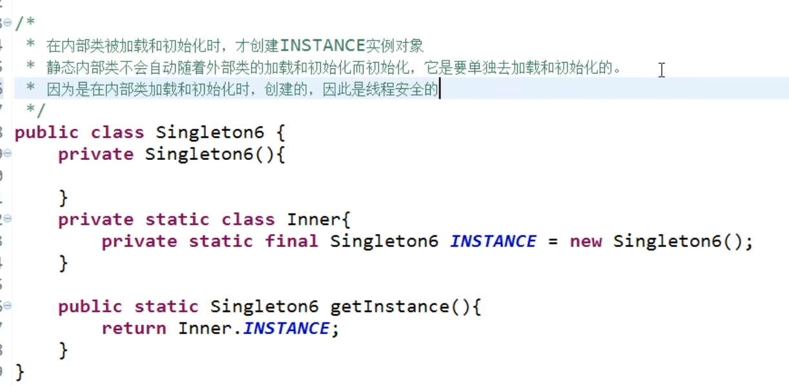
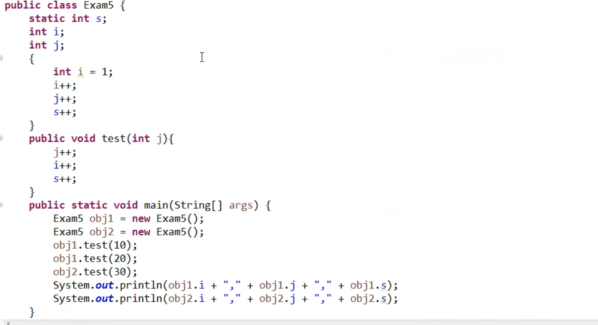
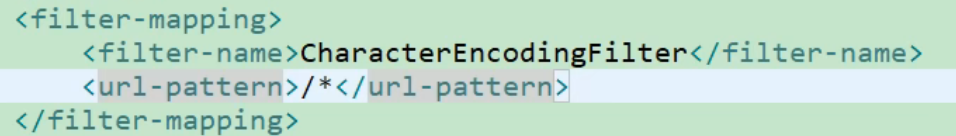

[toc]
# JavaSE
## 关于自增运算符++(自减--同理)
> 
> 
---
---
## 关于单例(Singleton)模式
> 
> 
> 
### 饿汉式
#### 直接实例化饿汉式
>>>> 
>>>> 
#### 枚举式
>>>> 
>>>> 
#### 静态代码块饿汉式(适合复杂实例化)
>>>> 
>>>> 
>>>> 
---
### 懒汉式
#### 线程不安全
>>>> 
#### 解决线程不安全:使用同步锁
>>>> 
#### 解决线程不安全:静态内部类形式
>>>> 
---
---
## 关于类和其实例的初始化过程中，其成员变量(静态和非静态)、方法(静态和非静态)、代码块(静态和非静态)、构造器的先后执行顺序
>>> 
>>> 
>>> 
>>> 
>>> 
>>> 
---
---
## 方法的参数传递
>> 
>> 
---
---
## 递归与迭代
>> 
>> 
>> 
>> 
>> 
>> 
---
---
## 成员变量与局部变量
>> 
>> 
>> 
>> 
>> 
>> 
>> 
---
---
## Spring Bean的作用域之间有什么区别
>> 
>> 
---
---
## Spring支持的常用数据库事务传播属性和事务隔离级别
>> 
>> 
>> 
>> 
>> 
>> 
>> 
>> 
>> 
---
---
## SpringMVC中处理post请求中文乱码问题
>> 
>> 
---
---
## SpringMVC的工作流程
### 获取参数的过程
>>> 
---
---
## MyBatis中实体类的属性名和表中的字段名不一样如何处理
### 写SQL语句时给字段起别名(别名与实体类属性名一致)
>>> 
### 在MyBatis全局配置文件中开启驼峰命名规则
>>> 
### 在Mapper映射文件中使用resultMap自定义映射规则
>>> 
---
---
## Git分支相关命令
>> 
>> 
---
---
## MySQL什么时候建索引
>> 
>> 
>> 
---
---
## GC
>> 
>> 
>> 
>> 
>> 
>> 
>> 
>> 
>> 
>> 
>> 
---
---
## 单点登录实现过程
>> 
>> 
>> 
---
---
## 购物车实现过程
>> 
>> 
---
---
## 消息队列在项目中的使用
>> 
>> 
>> 
>> 
>> 
>> 
>> 